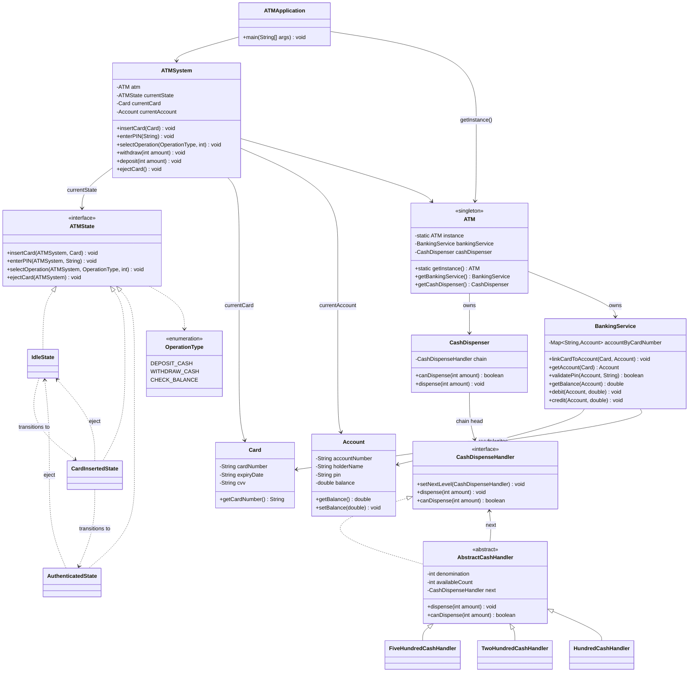
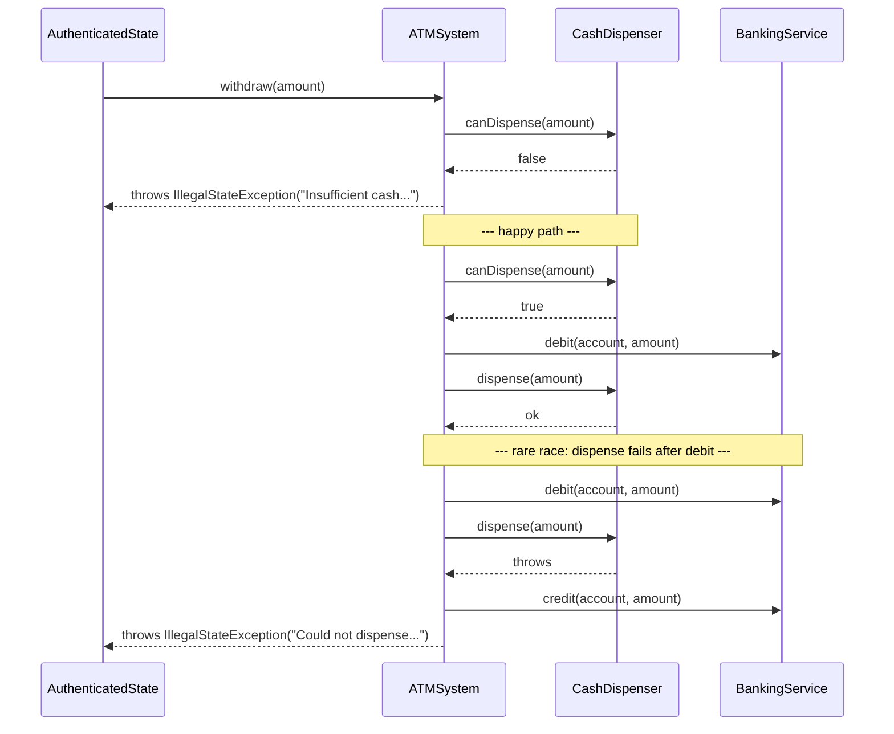

# ATM — Design

## Class Diagram



## Withdrawal Flow (Sequence)



## Key Design Decisions

1. **No-arg Singleton — `ATM` builds its own dependencies.** Earlier this took
   `getInstance(atmId, location, cashDispenser, bankingService)`, which silently
   discarded those arguments on every call after the first — call it out of order
   and you'd get a fully-formed-looking but wrongly-wired `ATM` with no error.
   `ATM`'s private constructor now builds its own `BankingService` and wires its own
   `CashDispenser` chain internally, so `getInstance()` takes no arguments at all —
   there's no "first call is special" case to get wrong.

2. **Withdraw is debit-then-dispense, not dispense-then-debit.** `ATMSystem.withdraw`
   calls `cashDispenser.canDispense(amount)` as a read-only pre-check, then
   `bankingService.debit(...)` **before** `cashDispenser.dispense(...)`. This order
   matters: if `dispense()` unexpectedly fails *after* a successful debit, the fix is
   just `bankingService.credit(...)` — a cheap, reliable ledger correction. The
   reverse order (dispense first) would mean a failure after a successful dispense
   leaves cash physically gone with no compensating action possible. This is a
   compensating-transaction, not a true cross-system transaction — `BankingService`
   and `CashDispenser` are independent resources with no shared commit protocol,
   which is the honest constraint here.

3. **Chain of Responsibility, fixed order, no Strategy layer.** Each
   `AbstractCashHandler` holds its own `denomination` + `availableCount` and is wired
   to the next handler once, at `ATM` construction (500 → 200 → 100). `canDispense`
   is a read-only mirror of `dispense` that walks the same chain without mutating
   counts, so it can be used as a pre-check. An earlier version added a
   `DenominationStrategy` (`Lower`/`HigherDenominationFirst`) to pick the order
   dynamically and rebuilt the chain from a `Map` on every call — removed, since the
   order never actually needs to change at runtime for this problem, and a fixed
   chain built once is simpler and just as correct.

4. **`BankingService` seeds its own demo data.** Its constructor links one demo
   card/account, so `ATM`/`ATMSystem`/`ATMApplication` don't need to wire that up
   externally — `linkCardToAccount` stays public for adding more.

5. **State Pattern** — `ATMSystem` is the context; `IdleState`, `CardInsertedState`,
   `AuthenticatedState` each decide which actions are legal and drive the transition
   to the next state, throwing immediately on invalid actions instead of
   silently no-oping.

6. **Service layer, separate from data models** — `CashDispenser` and
   `BankingService` live in `atm.service` because they hold behavior; `atm.model`
   holds plain entities (`Card`, `Account`) plus `ATM`, which composes the two
   services rather than being a data record itself.

7. **`ATM` and `CashDispenser` point one way.** `ATM` owns a `CashDispenser`;
   `CashDispenser` has no reference back to `ATM`, and never needs one — it only
   needs its handler chain.

## How to Run

```bash
cd atm
javac -d out $(find . -name "*.java")
java -cp out atm.ATMApplication
```
