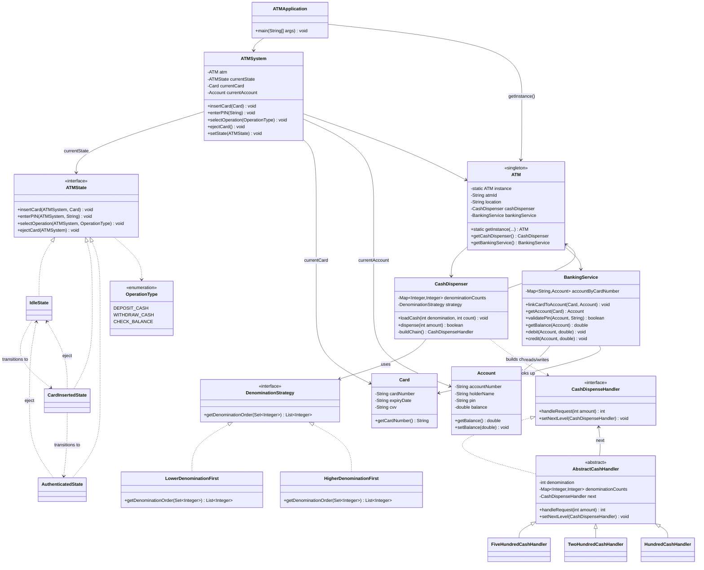
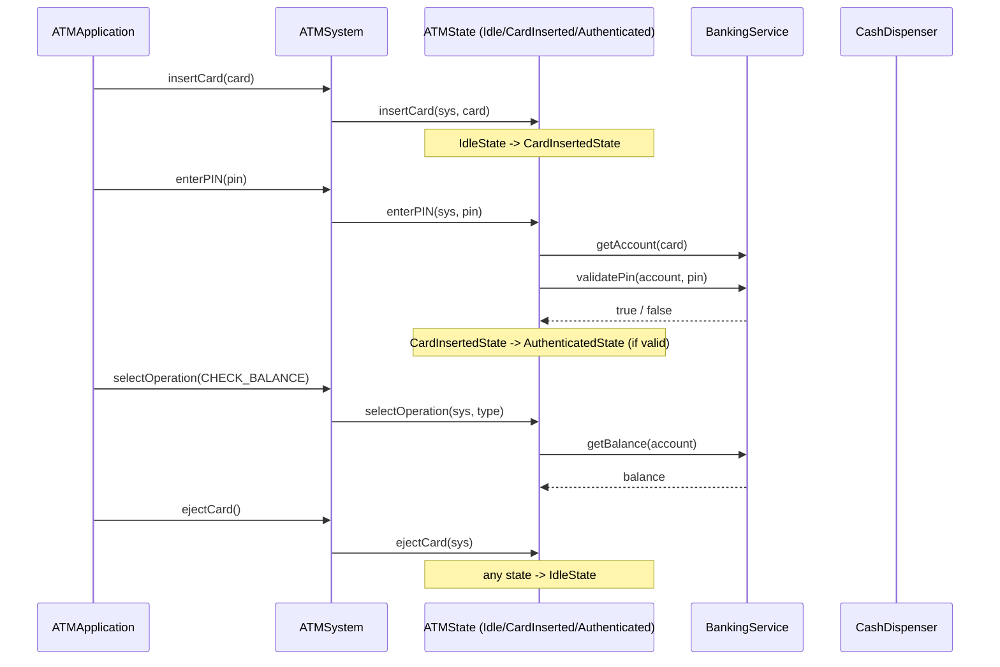

# ATM — Design

## Class Diagram



## Session Flow (Sequence)



## Key Design Decisions

1. **Singleton** — `ATM` represents the single physical machine the application
   models, so it exposes a static `getInstance(...)` instead of a public constructor.
   The first call wires in its `CashDispenser` and `BankingService`; every later call
   (including the no-arg `getInstance()`) returns that same instance.

2. **Service layer, separate from data models** — `CashDispenser` and `BankingService`
   live in `atm.service` because they hold *behavior* (dispensing cash, validating a
   PIN, debiting/crediting an account), not just data. `atm.model` is left with plain
   entities (`Card`, `Account`) plus `ATM`, which is really a composition root/facade
   over the two services rather than a data record itself.

3. **State Pattern** — `ATMSystem` is the context; `ATMState` implementations
   (`IdleState`, `CardInsertedState`, `AuthenticatedState`) each decide which of the
   four actions are legal and drive the transition to the next state. Invalid actions
   for a state (e.g. entering a PIN with no card inserted) throw immediately instead
   of silently no-oping.

4. **Strategy + Chain of Responsibility, split by responsibility** — `CashDispenser`
   asks its `DenominationStrategy` **which order** to try denominations in
   (`LowerDenominationFirst` vs `HigherDenominationFirst`), then links
   `CashDispenseHandler`s in that order. Each handler only knows **how to serve its
   own denomination** and pass the remainder down the chain — so the ordering policy
   and the per-denomination dispensing math stay independent and swappable.

5. **`AbstractCashHandler` removes boilerplate** — `FiveHundredCashHandler`,
   `TwoHundredCashHandler`, `HundredCashHandler` are now three-line subclasses that
   just fix a denomination; the shared notes-needed/available/remainder math and the
   `next` pointer live once in the abstract base.

6. **`BankingService` is a concrete class, not an interface** — it implements the
   basic steps directly (in-memory `Map<cardNumber, Account>`, PIN check, balance
   debit/credit) rather than being an abstraction over multiple backends. If a real
   backend integration is ever needed, this class is the natural seam to extract an
   interface from later — no need to design for it up front.

7. **Known gap, deliberately deferred** — `ATMState.selectOperation` doesn't carry an
   amount, so `DEPOSIT_CASH`/`WITHDRAW_CASH` currently throw
   `UnsupportedOperationException`. `CHECK_BALANCE` needs no amount, so it's fully
   wired. Also, `CashDispenser.dispense` mutates denomination counts as it walks the
   chain with no rollback if the full amount can't be served — worth a two-pass
   check (can-fulfill, then commit) before wiring up real withdrawals.

## How to Run

```bash
cd atm
javac -d out $(find . -name "*.java")
java -cp out atm.ATMApplication
```
