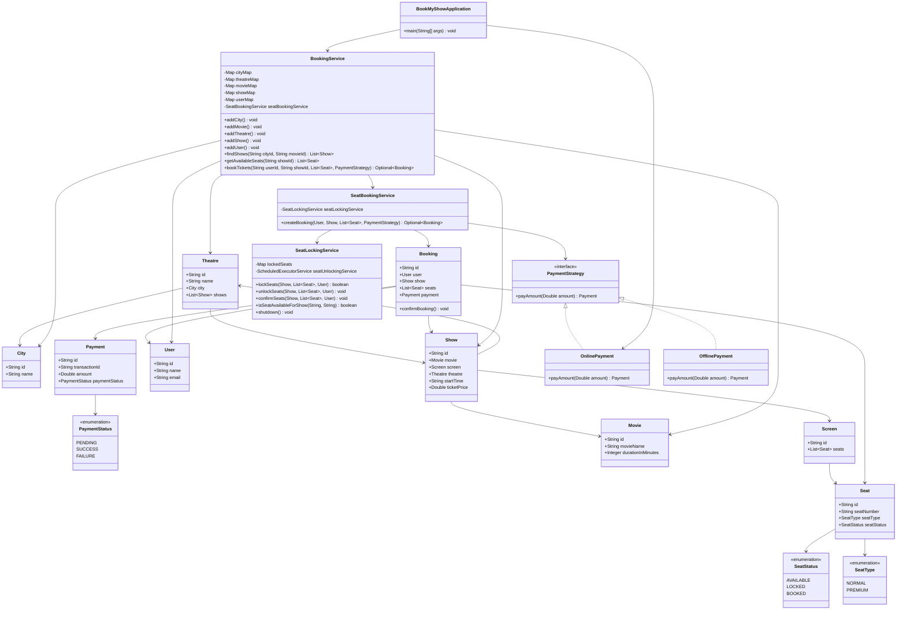
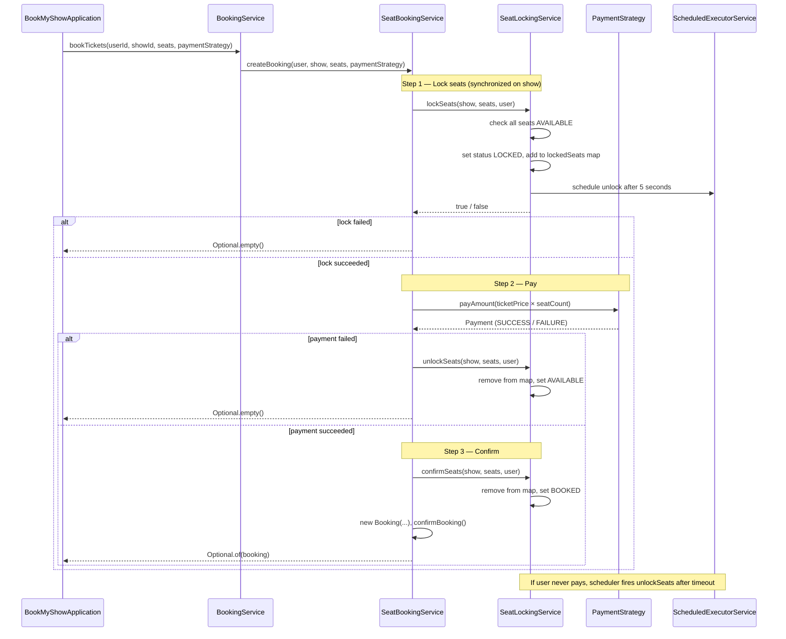

# BookMyShow — Design

A low-level design for an online movie ticket booking system.
Users search for shows, pick seats, pay, and receive a confirmed booking — without
two users ever booking the same seat.

---

## 1. The Problem in Plain English

A user opens BookMyShow, picks a city and movie, chooses a show time, selects seats,
and pays. Meanwhile, hundreds of other users may be trying to book the **same seat**
at the **same time**.

The system must answer:

> **Are these seats still free for this show, and can I hold them long enough to pay?**

It does **not** (in this LLD):
- Handle user login / OTP
- Integrate with real payment gateways
- Persist data to a database

It **does**:
- Manage catalog (cities, movies, theatres, shows, seats)
- Temporarily lock seats while the user pays
- Confirm or release seats based on payment outcome
- Prevent double booking under concurrent requests

---

## 2. The Big Picture

Every booking goes through the same four steps:

```
┌──────────┐     ┌──────────┐     ┌──────────┐     ┌──────────┐     ┌──────────┐
│  SEARCH  │ ──▶ │  SELECT  │ ──▶ │   LOCK   │ ──▶ │   PAY    │ ──▶ │  CONFIRM │
│  shows   │     │  seats   │     │  seats   │     │  amount  │     │  booking │
└──────────┘     └──────────┘     └──────────┘     └──────────┘     └──────────┘
                                        │                 │
                                        │                 └── failure ──▶ UNLOCK
                                        └── timeout (5s) ──────────────▶ UNLOCK
```

**Seat lifecycle:**

```
AVAILABLE  ──lockSeats()──▶  LOCKED  ──confirmSeats()──▶  BOOKED
                ▲                │
                │                └── unlockSeats() / timeout ──┘
                └──────────────────────────────────────────────┘
```

---

## 3. Class Diagram



---

## 4. Booking Flow (Sequence)



---

## 5. All Components Explained

### Layer 1 — Models (data only)

| Component | What it represents | Key fields |
|-----------|-------------------|------------|
| **City** | A city where theatres exist | id, name |
| **Movie** | A film | id, movieName, durationInMinutes |
| **Theatre** | A cinema in a city | id, name, city, shows |
| **Screen** | A hall inside a theatre | id, seats |
| **Seat** | One physical seat in a screen | id, seatNumber, seatType, seatStatus |
| **Show** | One movie screening at a specific time | id, movie, screen, theatre, startTime, ticketPrice |
| **User** | A person booking tickets | id, name, email |
| **Payment** | A payment attempt | id, transactionId, amount, paymentStatus |
| **Booking** | A confirmed reservation | id, user, show, seats, payment |

**Object hierarchy:**

```
City
 └── Theatre
      └── Show (movie + startTime + ticketPrice)
           └── Screen
                └── Seat (seatNumber, seatType, seatStatus)
```

### Layer 2 — Enums

| Enum | Values | Used for |
|------|--------|----------|
| **SeatStatus** | AVAILABLE, LOCKED, BOOKED | Seat lifecycle during booking |
| **SeatType** | NORMAL, PREMIUM | Pricing tiers (future use) |
| **PaymentStatus** | PENDING, SUCCESS, FAILURE | Payment outcome |

### Layer 3 — Strategy (payment)

| Component | Role |
|-----------|------|
| **PaymentStrategy** | Interface — `payAmount(Double amount)` |
| **OnlinePayment** | Simulates UPI/card payment |
| **OfflinePayment** | Simulates cash/counter payment |

Swapping payment method does not change booking logic — classic **Strategy Pattern**.

### Layer 4 — Services

| Service | Responsibility |
|---------|---------------|
| **BookingService** | Catalog management + entry point for search and booking |
| **SeatBookingService** | Orchestrates lock → pay → confirm/unlock |
| **SeatLockingService** | Thread-safe seat locking with timed auto-unlock |

---

## 6. SeatLockingService — Deep Dive

This is the most important class for concurrency.

### Data structures

```
lockedSeats: Map<showId, Map<seatId, userId>>

Example:
  "show-1" → { "seat-screen-1-1" → "user-1", "seat-screen-1-2" → "user-1" }
```

- Outer map keyed by `showId` — locks are per show
- Inner map keyed by `seatId` — which user holds each seat
- `ConcurrentHashMap` for safe concurrent reads from multiple threads

### Methods

| Method | When called | What it does |
|--------|-------------|--------------|
| `lockSeats` | User selects seats | Check all AVAILABLE → set LOCKED → add to map → schedule auto-unlock |
| `unlockSeats` | Payment fails, or timeout | Remove from map → set AVAILABLE (only if still LOCKED) |
| `confirmSeats` | Payment succeeds | Remove from map → set BOOKED |
| `isSeatAvailableForShow` | Listing available seats | Returns false if seat is in the lock map |
| `shutdown` | App exit | Stops the scheduler thread pool |

### Why `synchronized (show)`?

```java
synchronized (show) {
    // check + lock all seats atomically
}
```

- Two users racing for the same seat on the **same show** are serialized
- Users booking seats on **different shows** are not blocked by each other
- Prevents the TOCTOU bug: "check available" then "lock" as one atomic unit

### Why `ScheduledExecutorService`?

When a user locks seats but abandons checkout, seats must be released automatically:

```java
seatUnlockingService.schedule(
    () -> unlockSeats(show, seats, user),
    LOCK_TIMEOUT_MS,
    TimeUnit.MILLISECONDS
);
```

- Pool size `1` is enough — unlock tasks are tiny
- On payment success, `confirmSeats` sets status to `BOOKED`; when the scheduled
  task fires later, `unlockSeats` sees status ≠ LOCKED and does not reset the seat

### `isSeatAvailableForShow` — intentionally unsynchronized

This is a **best-effort read** for listing seats. The authoritative check happens
inside `lockSeats` under `synchronized (show)`. A seat shown as "available" might
get locked by another user before this user clicks "Book" — `lockSeats` handles that.

`BookingService.getAvailableSeats` uses both checks:

```java
lockingService.isSeatAvailableForShow(showId, seat.getId())
    && seat.getSeatStatus() == SeatStatus.AVAILABLE
```

---

## 7. Key Design Decisions

1. **Strategy Pattern for payment** — `PaymentStrategy` lets the caller pass
   `OnlinePayment` or `OfflinePayment` without changing `SeatBookingService`.

2. **Separation of concerns across three services:**
   - `BookingService` — catalog + facade (what the app talks to)
   - `SeatBookingService` — booking workflow orchestration
   - `SeatLockingService` — concurrency + timed locks only

3. **`synchronized (show)` not `synchronized (this)`** — finer-grained locking.
   Locking seats for Show A does not block users booking Show B.

4. **All-or-nothing seat lock** — `lockSeats` checks every seat before locking any.
   If seat 3 is taken, seats 1 and 2 are not partially locked.

5. **Singleton on `BookingService`** — `getInstance()` is available but the demo
   uses `new BookingService()` directly. Catalog maps use `ConcurrentHashMap` for
   safe reads from multiple threads.

6. **In-memory storage** — all data lives in `HashMap` / `ConcurrentHashMap`.
   No database. Appropriate for LLD; production would use DB + distributed locks (Redis).

---

## 8. Thread Safety Summary

| Component | Mechanism |
|-----------|-----------|
| `SeatLockingService.lockSeats` | `synchronized (show)` |
| `SeatLockingService.unlockSeats` | `synchronized (show)` |
| `SeatLockingService.confirmSeats` | `synchronized (show)` |
| `SeatLockingService.isSeatAvailableForShow` | `ConcurrentHashMap` read (no sync — UI hint only) |
| `SeatLockingService` auto-unlock | `ScheduledExecutorService` (pool size 1) |
| `BookingService` catalog maps | `ConcurrentHashMap` |
| `BookMyShowApplication` demo | `ExecutorService` (fixed pool of 3) simulates concurrent users |

**Demo scenario:** 3 threads submit booking requests for the same seat simultaneously.
`synchronized (show)` ensures exactly one succeeds; the other two get `lockSeats` → false.

---

## 9. File Structure

```
bookmyshow/
├── BookMyShowApplication.java     # Entry point + concurrent booking demo
├── DESIGN.md
├── enums/
│   ├── PaymentStatus.java
│   ├── SeatStatus.java
│   └── SeatType.java
├── model/
│   ├── Booking.java
│   ├── City.java
│   ├── Movie.java
│   ├── Payment.java
│   ├── Screen.java
│   ├── Seat.java
│   ├── Show.java
│   ├── Theatre.java
│   └── User.java
├── service/
│   ├── BookingService.java        # Catalog + bookTickets facade
│   ├── SeatBookingService.java    # Lock → pay → confirm orchestration
│   └── SeatLockingService.java    # Concurrent seat locking + scheduler
└── strategy/
    ├── PaymentStrategy.java
    ├── OnlinePayment.java
    └── OfflinePayment.java
```

---

## 10. How to Run

```bash
cd bookmyshow
javac -d out enums/*.java model/*.java strategy/*.java service/*.java BookMyShowApplication.java
java -cp out BookMyShowApplication
```

**Expected output (concurrent demo):**

```
=== BookMyShow ===
Available seats: 4
3 users trying to book seat 1 at the same time...

user-2 could not book seat 1
user-3 could not book seat 1
user-1 booked seat 1

Seat 1 final status: BOOKED
```

---

## 11. Possible Extensions (Out of Scope)

| Extension | Approach |
|-----------|----------|
| Distributed locking | Redis `SETNX` with TTL instead of in-memory map |
| Per-seat-type pricing | Use `SeatType` in amount calculation |
| Cancel booking | `releaseSeats()` → set AVAILABLE, refund via `PaymentStrategy` |
| Waitlist | Queue users when show is sold out |
| Search by date range | Filter `showMap` by `startTime` |
| Cancel scheduled unlock on confirm | Store `ScheduledFuture` and call `.cancel(false)` in `confirmSeats` |
