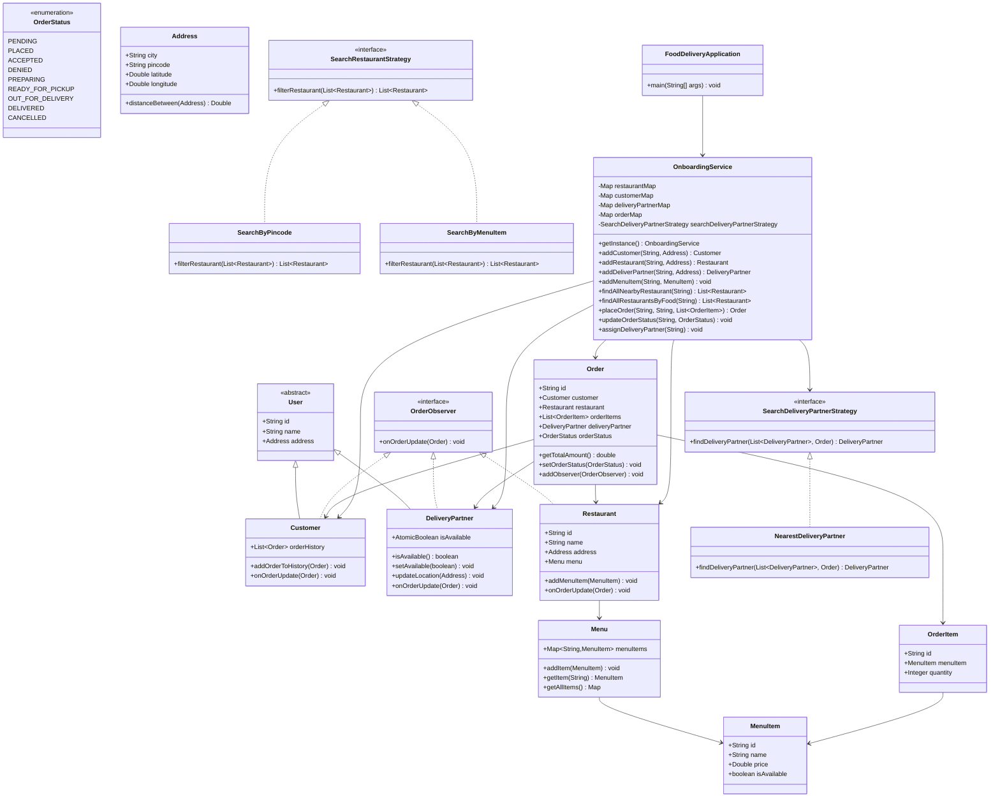
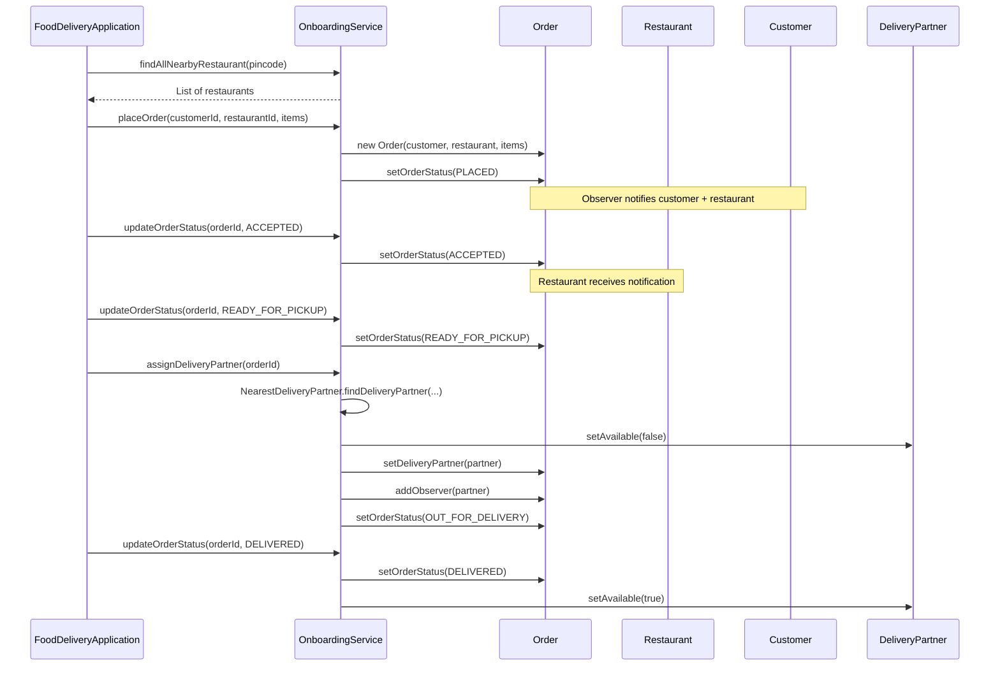

# Food Delivery — Design

A low-level design for an online food delivery platform.
Customers search for restaurants, place orders, and track delivery — while the
system assigns the nearest available delivery partner.

---

## 1. The Problem in Plain English

A customer opens the app, searches for restaurants near their pincode or by a
specific dish, places an order, and waits for food to arrive. Meanwhile, the
restaurant prepares the food and a delivery partner must be assigned to pick it up
and deliver it.

The system must answer:

> **Which restaurants can serve this customer, and how do we route the order from
> placement to delivery?**

It does **not** (in this LLD):
- Handle user login / authentication
- Integrate with real payment gateways
- Persist data to a database
- Handle real-time GPS tracking

It **does**:
- Onboard customers, restaurants, and delivery partners
- Search restaurants by pincode or menu item
- Place orders and track status via the Observer pattern
- Assign the nearest available delivery partner using the Strategy pattern
- Notify customer, restaurant, and delivery partner on status changes

---

## 2. The Big Picture

Every order goes through these steps:

```
┌──────────┐     ┌──────────┐     ┌──────────┐     ┌──────────┐     ┌──────────┐
│  SEARCH  │ ──▶ │  ORDER   │ ──▶ │ PREPARE  │ ──▶ │  ASSIGN  │ ──▶ │ DELIVER  │
│restaurant│     │  placed  │     │  food    │     │ partner  │     │  order   │
└──────────┘     └──────────┘     └──────────┘     └──────────┘     └──────────┘
```

**Order status lifecycle:**

```
PENDING ──▶ PLACED ──▶ ACCEPTED ──▶ PREPARING ──▶ READY_FOR_PICKUP
                                                        │
                                                        ▼
              DELIVERED ◀── OUT_FOR_DELIVERY ◀── (assign partner)

  (any stage) ──▶ CANCELLED / DENIED
```

**Who gets notified:**

```
Order
 ├── Customer        (observer — status updates)
 ├── Restaurant      (observer — status updates)
 └── DeliveryPartner (observer — added when assigned)
```

---

## 3. Class Diagram



---

## 4. Order Flow (Sequence)



---

## 5. All Components Explained

### Layer 1 — Models (data + light behavior)

| Component | What it represents | Key fields / methods |
|-----------|-------------------|----------------------|
| **Address** | A physical location with lat/long | city, pincode, latitude, longitude, `distanceBetween()` |
| **User** | Base class for people in the system | id, name, address |
| **Customer** | A person who places orders | orderHistory, `onOrderUpdate()` |
| **DeliveryPartner** | A rider who delivers orders | isAvailable, `updateLocation()` |
| **Restaurant** | A food outlet with a menu | name, address, menu |
| **Menu** | Collection of dishes | Map of MenuItem by id |
| **MenuItem** | A single dish | name, price, isAvailable |
| **OrderItem** | A dish + quantity in an order | menuItem, quantity |
| **Order** | A customer's order at a restaurant | customer, restaurant, items, status, observers |

### Layer 2 — Observer

| Component | Responsibility |
|-----------|---------------|
| **OrderObserver** | Interface — `onOrderUpdate(Order)` |
| **Order** | Maintains observer list; notifies on status change |

Customer and Restaurant are registered as observers at order creation.
DeliveryPartner is added when assigned.

### Layer 3 — Strategy

| Strategy | Used for |
|----------|----------|
| **SearchByPincode** | Filter restaurants matching a pincode |
| **SearchByMenuItem** | Filter restaurants that serve a given dish name |
| **NearestDeliveryPartner** | Pick the closest available partner to restaurant + customer route |

Swapping search or assignment logic does not change `OnboardingService` — classic
**Strategy Pattern**.

### Layer 4 — Service

| Service | Responsibility |
|---------|---------------|
| **OnboardingService** | Singleton facade — registry of all entities, order lifecycle, partner assignment |

---

## 6. NearestDeliveryPartner — Deep Dive

Distance is approximated using Euclidean distance on lat/long coordinates:

```
totalDistance = distance(restaurant, customer) + distance(partner, restaurant)
```

Only **available** partners are considered. When assigned, the partner is marked
unavailable; when the order is `DELIVERED`, they become available again.

This is a simplified heuristic. Production systems would use routing APIs,
traffic data, and partner workload balancing.

---

## 7. Key Design Decisions

1. **Singleton OnboardingService** — single in-memory registry for the demo.
   Production would use dependency injection and a database.

2. **Observer on Order** — decouples notification from status management.
   Customer, restaurant, and delivery partner react to changes without the
   service calling them directly.

3. **Strategy for search and assignment** — pincode search, menu search, and
   nearest-partner logic are pluggable.

4. **`ConcurrentHashMap` for registries** — safe for concurrent reads/writes if
   extended to multi-threaded scenarios.

5. **In-memory storage** — no database. Appropriate for LLD interviews.

6. **Order status as enum** — explicit lifecycle; easy to extend with
   `CANCELLED` / `DENIED` handling.

7. **Bug fix in `setOrderStatus`** — observers are notified **after** the status
   is updated so they see the new state.

---

## 8. File Structure

```
fooddelivery/
├── FoodDeliveryApplication.java       # Entry point + end-to-end demo
├── DESIGN.md
├── enums/
│   └── OrderStatus.java
├── model/
│   ├── Address.java
│   ├── Customer.java
│   ├── DeliveryPartner.java
│   ├── Menu.java
│   ├── MenuItem.java
│   ├── Order.java
│   ├── OrderItem.java
│   ├── Restaurant.java
│   └── User.java
├── observer/
│   └── OrderObserver.java
├── restaurantstrategy/
│   ├── SearchRestaurantStrategy.java
│   ├── SearchByPincode.java
│   └── SearchByMenuItem.java
├── deliverypartnerstrategy/
│   ├── SearchDeliveryPartnerStrategy.java
│   └── NearestDeliveryPartner.java
└── service/
    └── OnboardingService.java
```

---

## 9. How to Run

```bash
cd lld_problems/fooddelivery

javac -d out $(find . -name "*.java")
java -cp out FoodDeliveryApplication
```

**Expected output (observer lines on stderr):**

```
=== Food Delivery ===

Restaurants near pincode 560001:
  Pizza Palace (560001)

Restaurants serving Margherita Pizza:
  Pizza Palace (560001)

--- Order Flow ---
Order placed: <uuid> | Total: Rs 598.0
Customer Received Order Status: PLACED
Restaurant Received Order Status: PLACED
...
Assigning delivery partner...
Delivery Partner Ravi received order status: OUT_FOR_DELIVERY
...
Final order status: DELIVERED
Delivery partner available again: true

--- Second Order ---
Order <uuid> assigned to: Suresh
...
```

---

## 10. Possible Extensions

| Extension | Approach |
|-----------|----------|
| Payment | Strategy pattern — `PaymentStrategy` with UPI, card, wallet |
| Order cancellation | `updateOrderStatus(CANCELLED)` with refund hook |
| Rating & reviews | `Review` model linked to Order + Restaurant |
| Restaurant acceptance timeout | Scheduled task to auto-cancel if not `ACCEPTED` in N minutes |
| Menu search by partial name | Change `SearchByMenuItem` to use `contains()` instead of `equals()` |
| Multiple orders per partner | Track `List<Order>` on partner instead of boolean availability |
| Rename service | `OnboardingService` → `FoodDeliveryService` for clarity |
| Persistence | Replace maps with repository layer + database |
| Real distance | Haversine formula or external maps API |
