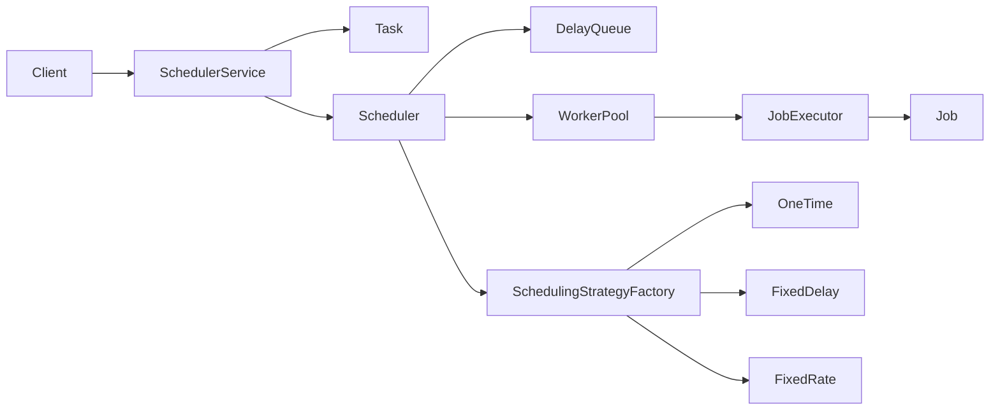

# Job Scheduler — LLD Guide

Plain Java layout (same style as `bookmyshow`): packages `enums`, `model`, `strategy`, `service`. No `JobSchedulerApplication` main here — wire that yourself for demos.

## Architecture



## Responsibilities

| Class | Role |
|--------|------|
| `Job` | What to run (`execute()`). |
| `Task` | Id, name, `TaskType`, `TaskStatus`, timing fields, reference to `Job`. |
| `ScheduledTaskEntry` | `Delayed` wrapper so `DelayQueue` orders by `nextExecutionTimeMs`. |
| `SchedulingStrategy` | After a run, compute next fire time; say if task repeats. |
| `OneTimeScheduling` | No reschedule (`computeNext` → `-1`). |
| `FixedDelayScheduling` | `finishedAt + fixedDelayMs`. |
| `FixedRateScheduling` | `previousScheduledStart + fixedRateMs` (drift if run is slow). |
| `JobExecutor` | Set RUNNING → call `job.execute()` → COMPLETED or FAILED. |
| `Scheduler` | Dispatcher thread + worker pool + reschedule hook (`onRunFinished`). |
| `SchedulerService` | API: schedule/cancel/get; owns `Map<String, Task>`. |

## Fixed delay vs fixed rate

- **Fixed delay**: next run starts **after** the previous run **ends**. Good when work duration varies.
- **Fixed rate**: next run is scheduled from **previous scheduled start + period**. Overlapping runs are possible if a run exceeds the period unless you add a “single-flight” guard.

## What you still implement

### 1. `Scheduler.start()` dispatcher loop

Pseudocode:

```text
running = true
dispatcherThread = new Thread(() -> {
  while (running.get()) {
    entry = queue.take()                    // blocks until due
    task = entry.getTask()
    if (task.isCancelled()) continue
    if (task.getNextExecutionTimeMs() != entry's expected time) continue  // stale entry

    workerPool.submit(() -> {
      long start = System.currentTimeMillis()
      if (task.getTaskType() == FIXEDRATE) {
        task.setPreviousScheduledStartMs(start)   // first run only; strategy updates after
      }
      jobExecutor.run(task)
      onRunFinished(task, System.currentTimeMillis())
    })
  }
})
dispatcherThread.start()
```

**Stale entries**: After `cancel()` or rescheduling, an old `ScheduledTaskEntry` may still sit in the queue. Compare `entry.getTask().getNextExecutionTimeMs()` with the time baked into the entry at creation, or bump a `generation` on `Task` and ignore mismatches.

### 2. `Scheduler.shutdown()`

Set `running` false, `interrupt()` dispatcher, `workerPool.shutdown()` + `awaitTermination`, handle tasks still in queue (policy: drop or run once).

### 3. `JobSchedulerApplication` (your main)

```text
SchedulerService svc = SchedulerService.getInstance()
svc.start()
svc.scheduleFixedDelay(() -> { ... }, "heartbeat", 1000, 5000)
// sleep or latch
svc.shutdown()
```

Use anonymous `Job` or lambdas only if you add a `Job` functional wrapper; interface `Job` needs a class or `new Job() { public void execute() ... }`.

## Optional extensions (interview plus points)

- `FAILED` retry with max attempts and backoff strategy
- Priority queue for high-priority tasks
- Persistence / leader election for multi-node (out of scope for in-memory LLD)
- Metrics: tasks run, failures, queue depth

## Package map

```text
jobscheduler/
  DESIGN.md
  JobSchedulerApplication.java   (you implement)
  enums/
    TaskType.java
    TaskStatus.java
  model/
    Job.java
    Task.java
    ScheduledTaskEntry.java
    Scheduler.java               (start/shutdown TODO)
  strategy/
    SchedulingStrategy.java
    OneTimeScheduling.java
    FixedDelayScheduling.java
    FixedRateScheduling.java
    SchedulingStrategyFactory.java
  service/
    JobExecutor.java
    SchedulerService.java
```
