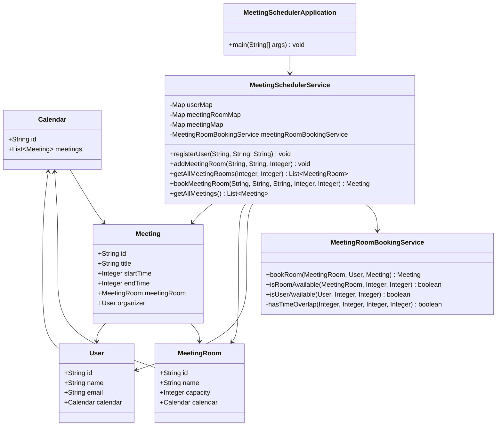
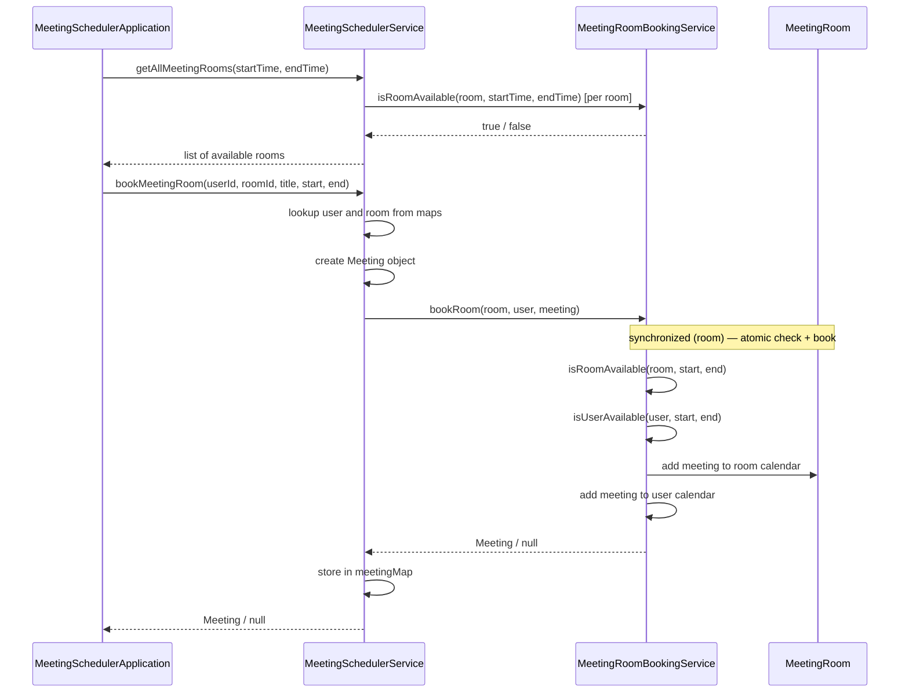

# Meeting Scheduler — Design

A low-level design for booking meeting rooms within a time slot.
Users can find available rooms and book one — without two users ever booking the
same room for overlapping times.

---

## 1. The Problem in Plain English

A user wants to book a conference room from 9 AM to 10 AM. Meanwhile, other users
may be trying to book the **same room** for the **same time slot** at the same moment.

The system must answer:

> **Which rooms are free for this time slot, and can I book one without a conflict?**

It does **not** (in this LLD):
- Handle user login / authentication
- Send calendar invites or email notifications
- Persist data to a database
- Filter rooms by capacity during availability search (capacity is stored but not used yet)

It **does**:
- Register users and meeting rooms
- Maintain a calendar per user and per room
- List available rooms for a given time slot
- Book a room atomically under concurrent requests
- Prevent double booking of the same room slot

---

## 2. The Big Picture

Every booking goes through two steps:

```
┌──────────────────┐     ┌──────────────────┐
│  FIND AVAILABLE  │ ──▶ │      BOOK        │
│  rooms for slot  │     │  room + calendars │
└──────────────────┘     └──────────────────┘
```

**Where bookings are stored:**

```
MeetingRoom
 └── Calendar
      └── List<Meeting>     ← room's schedule (source of truth for availability)

User
 └── Calendar
      └── List<Meeting>     ← user's personal schedule
```

When a meeting is booked, it is added to **both** the room calendar and the
organizer's user calendar.

---

## 3. Class Diagram



---

## 4. Booking Flow (Sequence)



---

## 5. All Components Explained

### Layer 1 — Models (data only)

All models are lightweight POJOs — no business logic, only fields and getters/setters.

| Component | What it represents | Key fields |
|-----------|-------------------|------------|
| **User** | A person who can organize meetings | id, name, email, calendar |
| **MeetingRoom** | A physical room that can be booked | id, name, capacity, calendar |
| **Calendar** | A schedule of meetings | id, meetings |
| **Meeting** | A booked time slot in a room | id, title, startTime, endTime, meetingRoom, organizer |

**Object hierarchy:**

```
User
 └── Calendar
      └── Meeting

MeetingRoom
 └── Calendar
      └── Meeting
```

### Layer 2 — Services

| Service | Responsibility |
|---------|---------------|
| **MeetingSchedulerService** | Registry of users, rooms, and meetings. Entry point for listing available rooms and booking. |
| **MeetingRoomBookingService** | Availability checks and atomic room booking under concurrency. |

---

## 6. MeetingRoomBookingService — Deep Dive

This is the most important class for correctness and concurrency.

### `isRoomAvailable`

Loops over the room's calendar meetings and checks for time overlap:

```java
start1 < end2 && end1 > start2
```

This handles all overlap cases — partial, exact, and wrap-around.

**Time convention:** intervals are half-open `[start, end)`. Adjacent slots like
`[9, 10)` and `[10, 11)` do **not** overlap.

| Existing | New request | Overlap? |
|----------|-------------|----------|
| 9–12 | 10–11 | Yes |
| 9–12 | 8–13 | Yes |
| 9–10 | 10–11 | No |

### `isUserAvailable`

Same overlap logic, applied to the organizer's user calendar. Prevents a user from
being double-booked across rooms.

### `bookRoom`

```java
synchronized (room) {
    if (!isRoomAvailable(...)) return null;
    if (!isUserAvailable(...)) return null;
    room.getCalendar().getMeetings().add(meeting);
    user.getCalendar().getMeetings().add(meeting);
    return meeting;
}
```

### Why `synchronized (room)`?

- Two users racing for the **same room** are serialized
- Users booking **different rooms** are not blocked by each other
- Prevents the TOCTOU bug: "check available" and "book" happen as one atomic unit

This mirrors `synchronized (show)` in BookMyShow's `SeatLockingService`.

### `isRoomAvailable` outside the lock — intentionally a hint

`getAllMeetingRooms(startTime, endTime)` calls `isRoomAvailable` without holding
the room lock. This is a **best-effort read** for listing rooms. The authoritative
check happens inside `bookRoom` under `synchronized (room)`. A room shown as
available might get booked by another thread before this user completes booking —
`bookRoom` handles that by re-checking.

---

## 7. Key Design Decisions

1. **Lightweight models** — all logic lives in the service layer. Models are plain
   data holders with getters and setters.

2. **Calendar per entity** — each `User` and `MeetingRoom` owns a `Calendar`.
   Room calendar is the source of truth for room availability; user calendar tracks
   the organizer's schedule.

3. **Separation of concerns across two services:**
   - `MeetingSchedulerService` — registry + facade (what the app talks to)
   - `MeetingRoomBookingService` — availability checks + atomic booking

4. **`synchronized (room)` not `synchronized (this)`** — finer-grained locking.
   Booking Room A does not block users booking Room B.

5. **`ConcurrentHashMap` for registry maps** — `userMap`, `meetingRoomMap`, and
   `meetingMap` are safe for concurrent reads and writes from multiple threads.

6. **In-memory storage** — all data lives in `ConcurrentHashMap` and `ArrayList`.
   No database. Appropriate for LLD; production would use a DB + distributed locks.

7. **No Optional** — methods return `Meeting` or `null` for simplicity.

8. **Integer time slots** — times are represented as integers (e.g. `9` = 9 AM,
   `10` = 10 AM) instead of `LocalDateTime` to keep the LLD focused on booking
   logic rather than date/time parsing.

---

## 8. Thread Safety Summary

| Component | Mechanism |
|-----------|-----------|
| `MeetingRoomBookingService.bookRoom` | `synchronized (room)` |
| `MeetingRoomBookingService.isRoomAvailable` | No sync — best-effort read for listing |
| `MeetingRoomBookingService.isUserAvailable` | Called only inside `synchronized (room)` during booking |
| `MeetingSchedulerService` registry maps | `ConcurrentHashMap` |
| Calendar `ArrayList` mutations | Protected by `synchronized (room)` during booking |
| `MeetingSchedulerApplication` demo | `ExecutorService` (fixed pool of 3) simulates concurrent users |

**Demo scenario:** 3 threads try to book `room-1` for the same slot simultaneously.
`synchronized (room)` ensures exactly one succeeds; the other two get `null`.

---

## 9. File Structure

```
meetingscheduler/
├── MeetingSchedulerApplication.java   # Entry point + concurrent booking demo
├── DESIGN.md
├── models/
│   ├── Calendar.java                  # id + list of meetings
│   ├── Meeting.java                   # booked time slot
│   ├── MeetingRoom.java               # room with calendar
│   └── User.java                      # user with calendar
└── service/
    ├── MeetingSchedulerService.java   # Registry + facade
    └── MeetingRoomBookingService.java # Availability + atomic booking
```

---

## 10. How to Run

```bash
cd lld_problems/meetingscheduler

javac -d out $(find . -name "*.java")
java -cp out MeetingSchedulerApplication
```

**Expected output:**

```
=== Meeting Scheduler ===
Available rooms from 9 to 10:
  Conference A
  Conference B
  Huddle Room

3 users trying to book Conference A for the same slot...

Booked room Conference A for Alice's Meeting
user-1 booked room-1
Room Conference A is not available for this slot.
user-2 could not book room-1
Room Conference A is not available for this slot.
user-3 could not book room-1

Available rooms after concurrent booking:
  Conference B
  Huddle Room

Total meetings booked: 1
```

---

## 11. Possible Extensions

| Extension | Approach |
|-----------|----------|
| Cancel a meeting | Remove from room + user calendars, update `meetingMap` |
| Filter by capacity | Check `room.getCapacity() >= requiredCapacity` in `getAllMeetingRooms` |
| Participants | Add `List<User> participants` to `Meeting`, check all calendars on book |
| Recurring meetings | New `RecurringMeeting` model + expansion into individual slots |
| Room allocation strategy | Strategy pattern to pick smallest-fit room vs nearest room |
| Distributed deployment | Replace `synchronized (room)` with Redis distributed lock per room |
