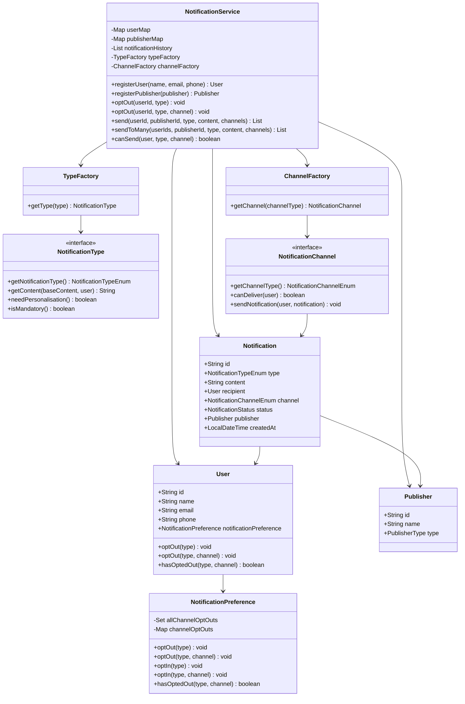
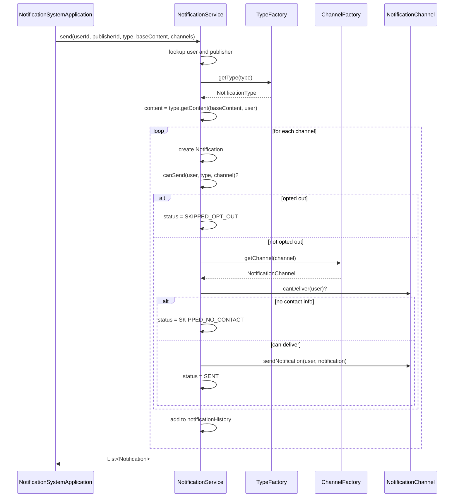

# Notification System — Design

A low-level design for delivering generic or personalised notifications across
multiple channels (email, SMS, in-app, push, WhatsApp), with per-user opt-out
support.

---

## 1. The Problem in Plain English

A platform needs to notify users about events — promotions, connection requests,
product availability, system alerts — through one or more channels.

The system must answer:

> **Can I send this notification to this user on this channel, and with what content?**

It does **not** (in this LLD):
- Integrate with real SMTP, SMS gateways, or push providers
- Handle user authentication
- Persist data to a database
- Retry failed deliveries asynchronously

It **does**:
- Register users and publishers
- Support generic and personalised notification content
- Route notifications to multiple channels via a strategy pattern
- Respect user opt-out preferences (per type, or per type + channel)
- Block opt-out for mandatory notifications (e.g. system alerts)
- Record delivery status for every attempted notification

---

## 2. The Big Picture

Every send request goes through a pipeline:

```
┌──────────────┐     ┌──────────────────┐     ┌─────────────────┐     ┌──────────────┐
│   PUBLISHER  │ ──▶ │ NotificationSvc  │ ──▶ │  TypeFactory    │ ──▶ │  Personalise │
│  (who sends) │     │  (orchestrator)  │     │  (content)      │     │  content     │
└──────────────┘     └──────────────────┘     └─────────────────┘     └──────────────┘
                              │
                              ▼
                     ┌──────────────────┐     ┌─────────────────┐
                     │  Opt-out check   │ ──▶ │  ChannelFactory │
                     │  (per user)      │     │  (delivery)     │
                     └──────────────────┘     └─────────────────┘
```

**Where preferences live:**

```
User
 └── NotificationPreference
      ├── allChannelOptOuts   (Set<NotificationTypeEnum>)
      └── channelOptOuts      (Map<Type, Set<Channel>>)
```

---

## 3. Class Diagram



---

## 4. Send Flow (Sequence)



---

## 5. All Components Explained

### Layer 1 — Models

| Component | What it represents | Key fields |
|-----------|-------------------|------------|
| **User** | A notification recipient | id, name, email, phone, notificationPreference |
| **Publisher** | Who triggers the notification | id, name, type (SYSTEM / USER / MARKETING) |
| **Notification** | A single delivery attempt | id, type, content, recipient, channel, status, publisher, createdAt |
| **NotificationPreference** | Per-user opt-out state | allChannelOptOuts, channelOptOuts |

### Layer 2 — Notification Types (Strategy)

Each type controls how content is built before delivery.

| Type | Personalised? | Mandatory? | Content behaviour |
|------|--------------|------------|-------------------|
| `PROMOTIONAL` | No | No | Returns `baseContent` as-is |
| `CONNECTION_REQUEST` | Yes | No | `"Hi {name}, " + baseContent` |
| `PRODUCT_AVAILABILITY` | Yes | No | `"{name}, good news! " + baseContent` |
| `SYSTEM_ALERT` | No | Yes | `"[ALERT] " + baseContent` |

`TypeFactory` maps `NotificationTypeEnum` → concrete `NotificationType` implementation.

### Layer 3 — Channels (Strategy)

Each channel knows how to deliver and whether the user has the required contact info.

| Channel | `canDeliver` requires |
|---------|----------------------|
| `EMAIL` | Non-blank email |
| `SMS` | Non-blank phone |
| `WHATSAPP` | Non-blank phone |
| `IN_APP` | Always true |
| `PUSH` | Always true |

`ChannelFactory` maps `NotificationChannelEnum` → concrete `NotificationChannel` implementation.
Channels log to stdout in this LLD (no real external integration).

### Layer 4 — Service

| Service | Responsibility |
|---------|---------------|
| **NotificationService** | Singleton orchestrator — registers users/publishers, manages opt-in/opt-out, sends notifications, records history |

---

## 6. NotificationPreference — Deep Dive

`NotificationPreference` is the single class that owns all opt-out state for a user.

### Two levels of opt-out

1. **All channels for a type** — stored in `allChannelOptOuts`
   ```java
   preference.optOut(NotificationTypeEnum.PROMOTIONAL);
   ```

2. **Specific channel for a type** — stored in `channelOptOuts`
   ```java
   preference.optOut(NotificationTypeEnum.PROMOTIONAL, NotificationChannelEnum.EMAIL);
   ```

### Lookup logic

```java
public boolean hasOptedOut(NotificationTypeEnum type, NotificationChannelEnum channel) {
    if (allChannelOptOuts.contains(type)) return true;
    Set<NotificationChannelEnum> channels = channelOptOuts.get(type);
    return channels != null && channels.contains(channel);
}
```

### Demo behaviour

Bob opts out of promotional **email** only:
- `PROMOTIONAL` + `EMAIL` → `SKIPPED_OPT_OUT`
- `PROMOTIONAL` + `IN_APP` → `SENT`

---

## 7. Key Design Decisions

1. **Strategy pattern for types and channels** — new notification types or delivery
   channels are added by implementing the interface and updating the factory. No
   changes to `NotificationService`.

2. **Generic vs personalised content** — `NotificationType.needPersonalisation()`
   signals intent; `getContent(baseContent, user)` performs the transformation.

3. **Mandatory notifications** — `SYSTEM_ALERT` overrides opt-out via
   `isMandatory()`. `NotificationService.optOut` throws `IllegalStateException`
   if a user tries to opt out of a mandatory type.

4. **Per-attempt status tracking** — each `(user, channel)` pair produces a
   separate `Notification` record with its own status:
   `SENT`, `SKIPPED_OPT_OUT`, `SKIPPED_NO_CONTACT`, `FAILED`.

5. **Singleton service** — `NotificationService.getInstance()` matches the pattern
   used in other LLD problems (e.g. food delivery's `OnboardingService`).

6. **In-memory storage** — users, publishers, and notification history live in
   memory. Appropriate for LLD; production would use a DB and a message queue.

7. **Publisher as first-class entity** — every notification records who sent it
   (marketing team, system, social network), useful for auditing and routing rules.

---

## 8. Notification Status Summary

| Status | When |
|--------|------|
| `SENT` | Channel delivered successfully |
| `SKIPPED_OPT_OUT` | User opted out of this type/channel |
| `SKIPPED_NO_CONTACT` | User missing email/phone required by channel |
| `FAILED` | Channel threw an exception during delivery |

---

## 9. File Structure

```
notificationsystem/
├── NotificationSystemApplication.java   # Entry point + demo scenarios
├── DESIGN.md
├── channels/
│   ├── NotificationChannel.java         # Channel interface
│   ├── ChannelFactory.java
│   ├── EmailChannel.java
│   ├── SmsChannel.java
│   ├── InAppChannel.java
│   ├── PushChannel.java
│   └── WhatsappChannel.java
├── enums/
│   ├── NotificationChannelEnum.java
│   ├── NotificationTypeEnum.java
│   ├── NotificationStatus.java
│   └── PublisherType.java
├── model/
│   ├── User.java
│   ├── Publisher.java
│   ├── Notification.java
│   └── NotificationPreference.java
├── service/
│   └── NotificationService.java
└── types/
    ├── NotificationType.java            # Type interface
    ├── TypeFactory.java
    ├── PromotionalNotification.java
    ├── ConnectionRequestNotification.java
    ├── ProductAvailabilityNotification.java
    └── SystemAlertNotification.java
```

---

## 10. How to Run

```bash
cd lld_problems/notificationsystem

javac -d out $(find . -name "*.java")
java -cp out NotificationSystemApplication
```

**Expected output (abbreviated):**

```
=== Notification System ===

Bob opted out of promotional emails.

--- Promotional (generic) via EMAIL + IN_APP ---
  Alice | EMAIL | SENT | Flat 50% off on all items this weekend!
  Bob | EMAIL | SKIPPED_OPT_OUT | Flat 50% off on all items this weekend!
  Bob | IN_APP | SENT | Flat 50% off on all items this weekend!

--- Connection request (personalised) via SMS + IN_APP ---
  Alice | SMS | SENT | Hi Alice, Charlie wants to connect with you.

--- System alert (mandatory) ---
  Bob | EMAIL | SENT | [ALERT] Scheduled maintenance tonight at 11 PM.

--- Opt-out guard for mandatory notifications ---
Blocked: Cannot opt out of mandatory notification type: SYSTEM_ALERT

Total notifications recorded: 9
```

---

## 11. Possible Extensions

| Extension | Approach |
|-----------|----------|
| Async delivery | Queue notifications in a `BlockingQueue`, worker threads consume and send |
| Retry on failure | Exponential backoff retry for `FAILED` status |
| Template engine | Replace string concatenation with a `TemplateRenderer` for personalisation |
| Notification batching | Aggregate multiple in-app notifications into a digest |
| Preference UI API | REST endpoints wrapping `optOut` / `optIn` / `getPreferences` |
| Rate limiting | Per-user/per-channel send limits via a token bucket |
| Real channel adapters | Swap stdout logging for SMTP, Twilio, FCM implementations |
