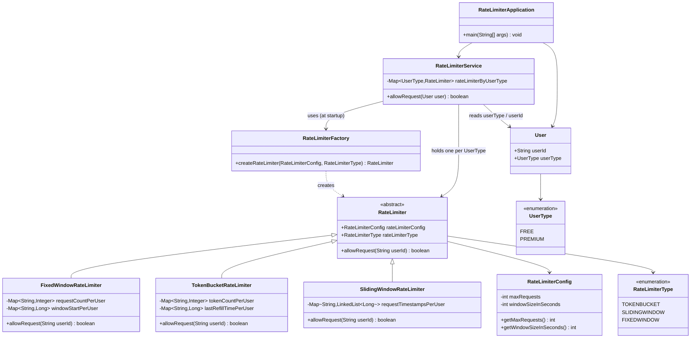
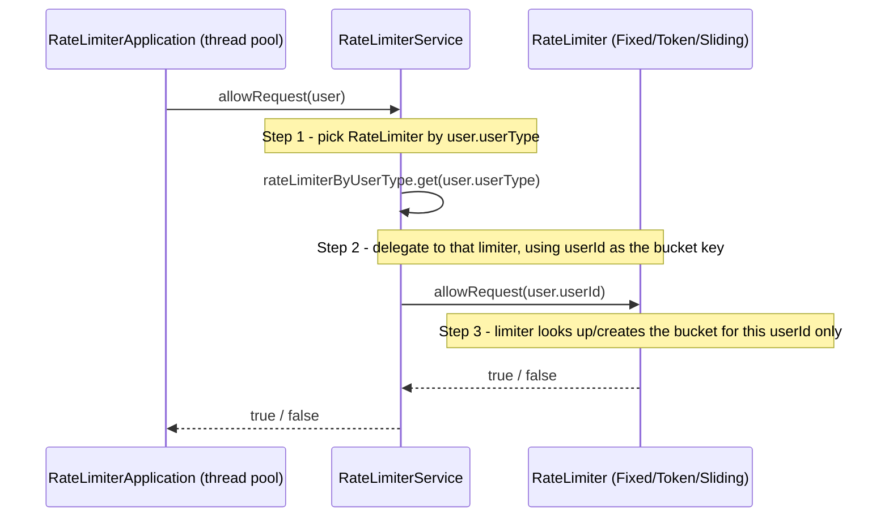

# RateLimiter — Design

## Class Diagram



## Request Flow (Sequence)



## Key Design Decisions

1. **Strategy Pattern** — `RateLimiter` is an abstract class with three interchangeable
   algorithms: `FixedWindowRateLimiter`, `TokenBucketRateLimiter`, `SlidingWindowRateLimiter`.
   Each implements `allowRequest(String userId)` independently, so the algorithm can be
   swapped without touching the service or application code.

2. **Factory Pattern** — `RateLimiterFactory` is the only place that knows how to build a
   concrete `RateLimiter` from a `RateLimiterType` + `RateLimiterConfig`.

3. **Two-level decision, split by responsibility**:
   - **"Which algorithm/config?"** → decided by `RateLimiterService`, based on `UserType`.
     - `FREE` → `FixedWindowRateLimiter` (3 requests / 10s) — strict, simple.
     - `PREMIUM` → `TokenBucketRateLimiter` (10 requests / 10s) — more generous, allows bursts.
   - **"Which bucket within that algorithm?"** → decided inside the `RateLimiter` itself,
     using `userId` as the map key. Each user gets an independent counter/bucket/window;
     one user being throttled never affects another user, even within the same `UserType`.

4. **Bucket key = userId** — this keeps `RateLimiter` implementations request-shape agnostic;
   they only ever see a `String` key, not the full `User`/`Request` object.

5. **Thread safety — per-user locking, not per-limiter locking.** Early on, `allowRequest`
   was `synchronized` at the method level, which locks on `this` and serializes **every**
   user through one global lock per limiter — even though users touch completely independent
   map entries. Instead, `RateLimiter` exposes `getLockForKey(key)`, which lazily creates and
   caches one lock object per bucket key (via `ConcurrentHashMap.putIfAbsent`, no manual
   double-checked locking needed). Each strategy now does
   `synchronized (getLockForKey(userId)) { ... }` around just its bucket logic, so requests
   for *different* users run fully in parallel, and only requests for the *same* user are
   serialized. The per-user maps (`tokenCountPerUser`, `windowStartPerUser`, etc.) are backed
   by `ConcurrentHashMap` rather than `HashMap`, since concurrent `put`/`get` calls for
   different keys from different threads are now possible.

6. **No premature per-request object churn** — `RateLimiterService` builds each `RateLimiter`
   once (at construction time) and reuses it for every request of that `UserType`, instead of
   creating a new limiter per request.

## How to Run

```bash
cd ratelimiter
javac -d out $(find . -name "*.java")
java -cp out RateLimiterApplication
```
