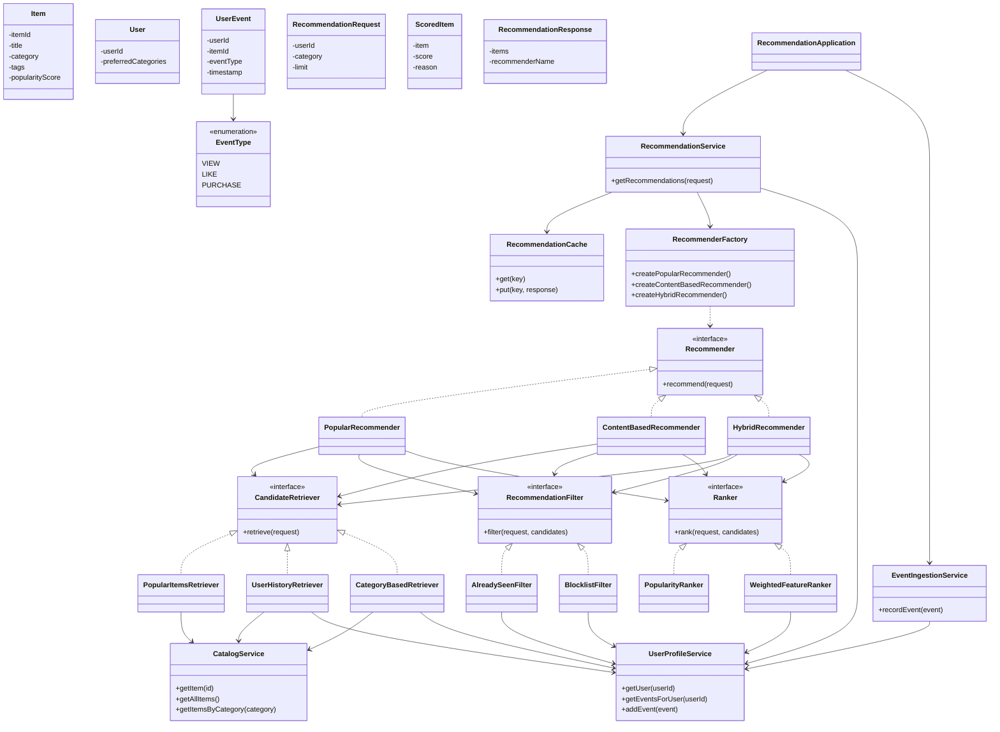
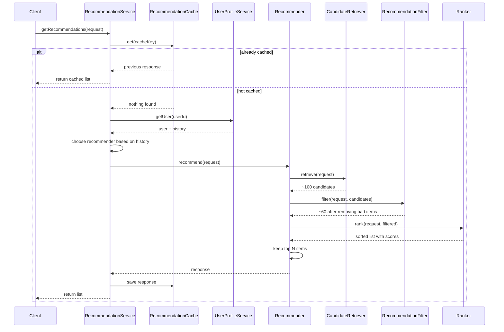
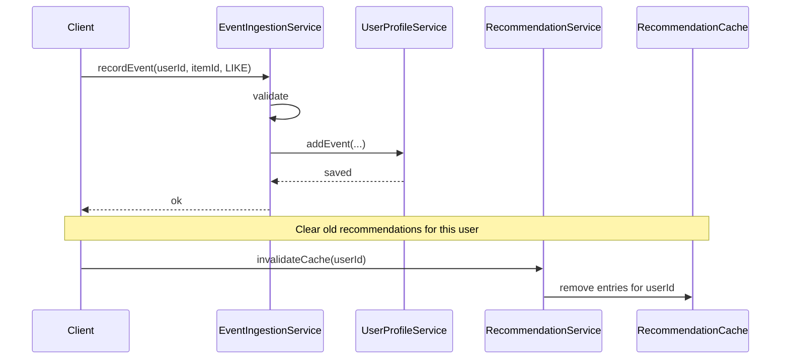

# Recommendation Service — Design

A generic design for a system that recommends **items** to **users**.
The items can be anything — videos, songs, products, articles. This design does not
care what the item actually is.

---

## 1. The Problem in Plain English

Imagine a store with millions of products and millions of customers. A user opens the
app and sees a "Recommended for you" section.

The system must answer:

> **Who is this user, and which items should we show them — in what order?**

That is the entire job of a recommendation service.

It does **not**:
- Store the full product catalog (another service does that)
- Handle login or payments
- Train machine-learning models (out of scope for this LLD)

It **does**:
- Read user history and item data from other services
- Pick a short list of good items
- Return them sorted best-first

---

## 2. The Big Picture (Read This First)

Every recommendation request goes through the same three steps:

```
┌─────────────┐     ┌─────────────┐     ┌─────────────┐     ┌──────────────┐
│   REQUEST   │ ──▶ │  RETRIEVE   │ ──▶ │   FILTER    │ ──▶ │     RANK     │ ──▶ RESPONSE
│  who + how  │     │ gather many │     │ remove bad  │     │ sort best    │
│  many items │     │  candidates │     │    ones     │     │   first      │
└─────────────┘     └─────────────┘     └─────────────┘     └──────────────┘
```

**Example with numbers:**

| Step | What happens | Count |
|------|--------------|-------|
| Request | User U1 wants 10 items | — |
| Retrieve | Pull 100 possible items from catalog + user history | 100 |
| Filter | Remove items user already bought or blocked | 60 left |
| Rank | Score each item, sort high to low, take top 10 | 10 returned |

Think of it like hiring:
1. **Retrieve** = collect 100 resumes (cast a wide net)
2. **Filter** = remove unqualified candidates
3. **Rank** = interview the rest and pick the top 10

This three-step pipeline is the most important idea in the whole design.

---

## 3. Two Separate Flows

The system has two jobs that should stay separate:

### Flow A — Get recommendations (READ)

```
Client  →  RecommendationService  →  Recommender  →  Response
```

The client asks "what should I show user U1?" and gets back a sorted list.
This path **never changes** user data.

### Flow B — Record what the user did (WRITE)

```
Client  →  EventIngestionService  →  UserProfileService
```

When a user views, likes, or purchases an item, that event is saved.
Later recommendations become more accurate because the system knows more about the user.

```
         ┌──────────────────────────────────────┐
         │         READ PATH (Flow A)          │
         │  getRecommendations(userId, limit)  │
         └──────────────────────────────────────┘

         ┌──────────────────────────────────────┐
         │         WRITE PATH (Flow B)          │
         │  recordEvent(userId, itemId, type)  │
         └──────────────────────────────────────┘
                        │
                        ▼
              UserProfileService stores history
                        │
                        ▼
              Future READ requests use that history
```

---

## 4. All Components Explained

### Layer 1 — Data (what we store)

These are plain objects with fields. No business logic.

| Component | What it represents | Key fields |
|-----------|-------------------|------------|
| **Item** | One thing we can recommend | id, title, category, tags, popularityScore |
| **User** | One person asking for recommendations | userId, preferredCategories |
| **UserEvent** | One action the user took in the past | userId, itemId, eventType, timestamp |
| **EventType** | Kind of action | VIEW, LIKE, PURCHASE |
| **RecommendationRequest** | What the client asks for | userId, category (optional), limit |
| **RecommendationResponse** | What we send back | list of scored items, which algorithm was used |
| **ScoredItem** | One item in the final answer | item, score, reason (optional text) |

**Why UserEvent matters:** Without history, every user gets the same "popular items"
list. Events are how the system learns preferences over time.

---

### Layer 2 — Data services (where data lives)

These classes **hold and serve data**. They do not decide what to recommend.

| Component | Responsibility |
|-----------|----------------|
| **CatalogService** | Stores all items. Can look up by id or category. |
| **UserProfileService** | Stores users, their preferences, and their event history. |
| **EventIngestionService** | The only entry point for saving new events. Validates and forwards to UserProfileService. |

```
CatalogService          UserProfileService
     │                         │
     │  items                  │  users + events
     │                         │
     └──────────┬──────────────┘
                │
         read by retrievers,
         filters, and rankers
```

---

### Layer 3 — The pipeline (how recommendations are built)

These three interfaces are the core of every recommendation algorithm.

#### CandidateRetriever — Step 1: Gather options

**Job:** Return a large list of items that *might* be good. Order does not matter yet.

| Implementation | Where candidates come from |
|----------------|---------------------------|
| **PopularItemsRetriever** | Globally popular items from the catalog |
| **UserHistoryRetriever** | Items similar to what this user liked before |
| **CategoryBasedRetriever** | Items in categories the user prefers |

You can have multiple retrievers. A hybrid approach runs two retrievers and merges
their results (removing duplicates).

#### RecommendationFilter — Step 2: Remove bad options

**Job:** Take the candidate list and remove items that should never be shown.

| Implementation | What it removes |
|----------------|-----------------|
| **AlreadySeenFilter** | Items the user already purchased |
| **BlocklistFilter** | Items the user explicitly blocked |

Filters only remove items. They never add new ones or change scores.

#### Ranker — Step 3: Score and sort

**Job:** Give every remaining item a number (score), sort highest first.

| Implementation | How score is calculated |
|----------------|------------------------|
| **PopularityRanker** | Score = item's global popularity |
| **WeightedFeatureRanker** | Score = mix of popularity + category match + tag overlap |

The top N items (where N = limit from the request) become the final answer.

---

### Layer 4 — Recommenders (different strategies)

A **Recommender** wires together one retriever (or more), one filter, and one ranker,
then runs the three-step pipeline.

All recommenders share the same interface: input = request, output = response.

| Recommender | When to use | Pipeline |
|-------------|-------------|----------|
| **PopularRecommender** | New user with no history ("cold start") | Popular retriever → filter → popularity ranker |
| **ContentBasedRecommender** | User has enough history | Category/history retriever → filter → weighted ranker |
| **HybridRecommender** | User has some but not much history | Two retrievers merged → filter → weighted ranker |

**Cold start problem:** A brand-new user has no events. You cannot personalize yet.
The system falls back to PopularRecommender — show what everyone else likes.

```
User history empty?     →  PopularRecommender
User history small?     →  HybridRecommender
User history rich?      →  ContentBasedRecommender
```

---

### Layer 5 — Orchestration (ties everything together)

| Component | Responsibility |
|-----------|----------------|
| **RecommendationService** | Public API. Checks cache, picks the right recommender, returns the response. |
| **RecommenderFactory** | Creates recommender objects with the correct retriever/filter/ranker wired in. |
| **RecommendationCache** | Stores recent results so the same request does not recompute every time. |

```
Client
  │
  ▼
RecommendationService
  ├── check RecommendationCache
  ├── read User from UserProfileService
  ├── pick Recommender (popular / content / hybrid)
  ├── call Recommender.recommend()
  └── save result in cache
```

---

## 5. How the Pieces Connect

```
                    ┌─────────────────────────┐
                    │  RecommendationService  │
                    │  (entry point)          │
                    └───────────┬─────────────┘
                                │
              ┌─────────────────┼─────────────────┐
              ▼                 ▼                 ▼
     RecommendationCache  RecommenderFactory  UserProfileService
                                │
                                ▼
                    ┌─────────────────────────┐
                    │      Recommender        │
                    │  (strategy: pick one)   │
                    └───────────┬─────────────┘
                                │
            ┌───────────────────┼───────────────────┐
            ▼                   ▼                   ▼
   CandidateRetriever   RecommendationFilter    Ranker
            │                   │                   │
            ▼                   ▼                   ▼
   CatalogService         UserProfileService   UserProfileService
   UserProfileService

   ─ ─ ─ ─ ─ ─ ─ ─ ─ ─ ─ ─ ─ ─ ─ ─ ─ ─ ─ ─ ─ ─

   EventIngestionService ──writes──▶ UserProfileService
```

---

## 6. Class Diagram



---

## 7. Sequence Diagrams

### 7a. Get recommendations



### 7b. Record a user event



---

## 8. Worked Example

**Setup:**
- Catalog has items A, B, C, D, E
- User U1 is new (no events)
- Request: userId=U1, limit=3

**Step 1 — RecommendationService receives request**

Cache is empty. User U1 has no history → choose **PopularRecommender**.

**Step 2 — Retrieve**

PopularItemsRetriever returns [A, B, C, D, E] sorted by global popularity.

**Step 3 — Filter**

AlreadySeenFilter: U1 never purchased anything → nothing removed.
Still [A, B, C, D, E].

**Step 4 — Rank**

PopularityRanker scores: A=90, B=80, C=70, D=60, E=50.
Sorted: [A, B, C, D, E].

**Step 5 — Trim**

Limit is 3 → return [A, B, C] with scores.

**Later — U1 likes item C**

EventIngestionService saves LIKE(C). Cache for U1 is cleared.

**Next request — U1 asks again**

Now U1 has history → choose **HybridRecommender**.
UserHistoryRetriever adds items similar to C.
WeightedFeatureRanker boosts category matches.
Result might now be [C, D, A] instead of [A, B, C].

---

## 9. Design Decisions (Why It Is Built This Way)

| Decision | Reason |
|----------|--------|
| Three-step pipeline (Retrieve → Filter → Rank) | Every algorithm shares the same shape. Easy to understand and extend. |
| Separate read and write paths | Getting recommendations should not accidentally change user data. |
| Recommender as a strategy | Swap algorithms (popular, content, hybrid) without changing the entry point. |
| Retriever / Filter / Ranker as separate interfaces | Each step can be replaced independently. |
| Generic Item (no Video, Song subclasses) | Same design works for any domain. Extra details go in tags. |
| Cold-start fallback to popular items | New users still get useful results on day one. |
| Cache on RecommendationService | Same user asking twice within minutes should not recompute. |
| EventIngestionService as single write entry | All validation happens in one place. |

---

## 10. Glossary

| Term | Meaning |
|------|---------|
| **Candidate** | An item that might be recommended. Not yet scored or ranked. |
| **Retrieve** | Find a large pool of possible items quickly. |
| **Filter** | Remove items that must not be shown. |
| **Rank** | Score remaining items and sort best-first. |
| **Cold start** | A user (or item) with little or no history to learn from. |
| **Personalization** | Tailoring results to one specific user. |
| **Hybrid** | Combining results from more than one retriever before ranking. |
| **Popularity score** | A precomputed number showing how popular an item is globally. |

---

## 11. Folder Structure (When You Implement)

```
recommendationservice/
├── DESIGN.md
├── RecommendationApplication.java
├── model/           ← Item, User, UserEvent, Request, Response
├── service/         ← CatalogService, UserProfileService, RecommendationService
├── pipeline/        ← CandidateRetriever, RecommendationFilter, Ranker (interfaces)
├── retriever/       ← PopularItemsRetriever, UserHistoryRetriever, ...
├── filter/          ← AlreadySeenFilter, BlocklistFilter
├── ranker/          ← PopularityRanker, WeightedFeatureRanker
├── recommender/     ← PopularRecommender, ContentBasedRecommender, HybridRecommender
├── factory/         ← RecommenderFactory
└── cache/           ← RecommendationCache
```

**Suggested build order:**

1. Models and data services (CatalogService, UserProfileService)
2. Pipeline interfaces
3. One complete path: PopularRecommender only
4. RecommendationService
5. Add Hybrid and ContentBased recommenders
6. EventIngestionService and a demo application
