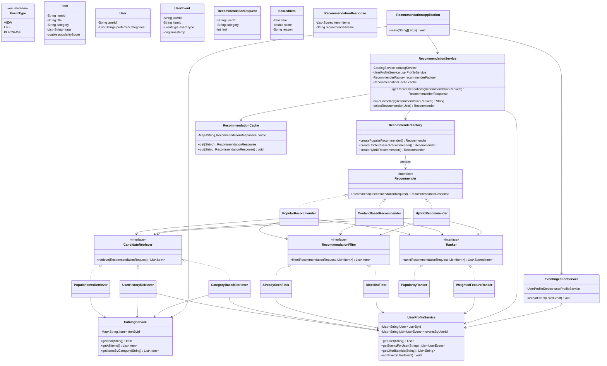
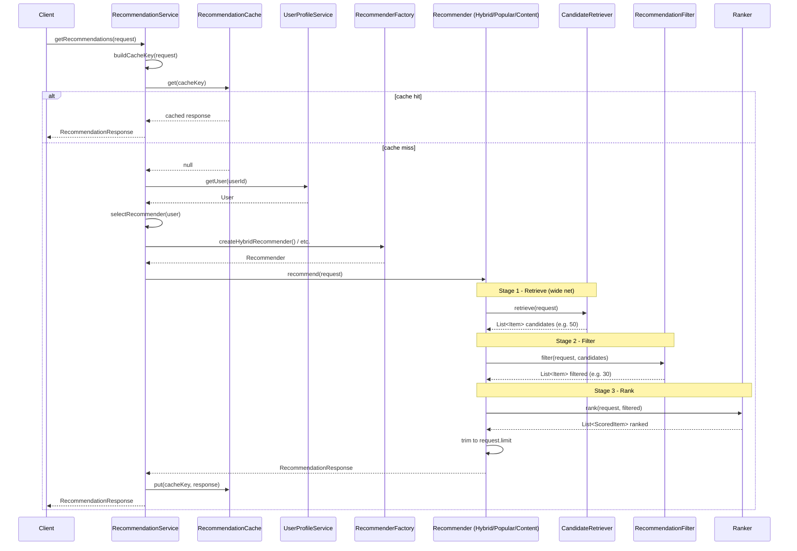
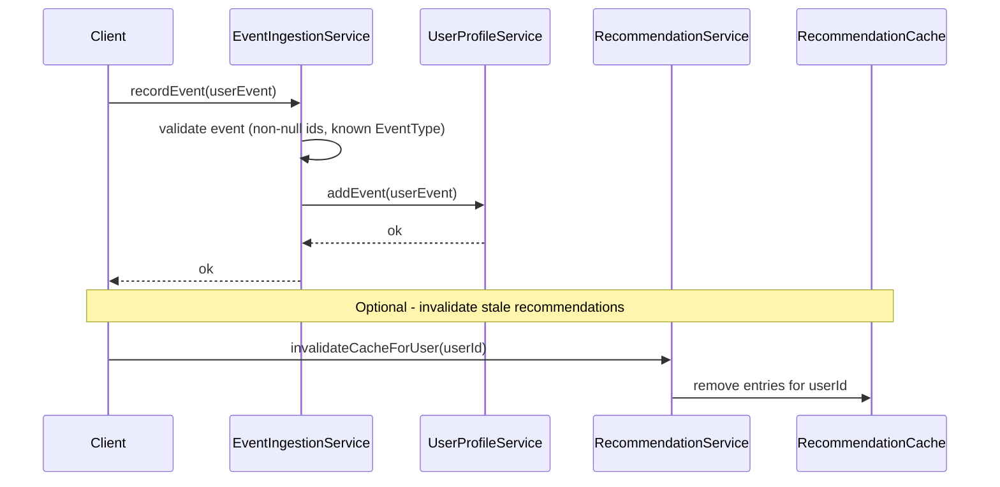

# Recommendation Service — Design

A generic, item-agnostic recommendation service. It can recommend videos, songs,
products, articles, or anything else — the design never hard-codes a domain.

---

## Table of Contents

1. [What Is a Recommendation Service?](#what-is-a-recommendation-service)
2. [Step-by-Step Interview Guide](#step-by-step-interview-guide)
3. [High-Level Architecture](#high-level-architecture)
4. [Component Reference](#component-reference)
5. [Class Diagram](#class-diagram)
6. [Sequence Diagrams](#sequence-diagrams)
7. [Reference Java (Plain, No Lambdas)](#reference-java-plain-no-lambdas)
8. [Key Design Decisions](#key-design-decisions)
9. [Package Layout (For Your Implementation)](#package-layout-for-your-implementation)
10. [How to Run (After You Implement)](#how-to-run-after-you-implement)

---

## What Is a Recommendation Service?

A recommendation service answers one question:

> **"Given this user and this context, which items should we show next?"**

It does **not** own the full product catalog or user accounts. It **reads** from other
services, runs a **pipeline**, and returns a ranked list of items.

### Real-world analogy

Think of a shop assistant:

1. **Know the customer** — what they bought before, what they like.
2. **Gather options** — walk the aisles and pick candidates (not every item in the store).
3. **Remove bad options** — out of stock, already bought today, blocked brand.
4. **Rank what's left** — put the best matches on top.
5. **Explain (optional)** — "Because you liked X."

Our LLD models exactly those five steps.

---

## Step-by-Step Interview Guide

Use this order in a 45–60 minute LLD round.

### Step 1 — Clarify requirements (5 min)

Say out loud:

| Topic | Assumption for this design |
|-------|---------------------------|
| Input | `userId`, optional `category`, `limit` (how many results) |
| Output | Ordered list of `Item` with a `score` and optional `reason` |
| Item type | Generic — one `Item` class with `id`, `title`, `category`, `tags` |
| Algorithms | Support multiple strategies; default is a simple **hybrid** |
| Events | Users generate `VIEW`, `LIKE`, `PURCHASE` events we can learn from |
| Scale (mention) | Cache hot users; retrievers read from in-memory maps for the LLD demo |
| Out of scope | ML model training, distributed search, A/B testing infra |

### Step 2 — Name the core entities (5 min)

Draw four boxes first:

- **User** — who is asking
- **Item** — what we recommend
- **UserEvent** — what the user did in the past (view, like, purchase)
- **RecommendationRequest / RecommendationResponse** — API contract

Interview tip: *entities are nouns; services are verbs.*

### Step 3 — Draw the pipeline (10 min)

Every recommender follows the same stages:

```
Request → [Retrieve candidates] → [Filter] → [Rank] → Response
```

- **Retrieve** — cast a wide net (maybe 100 items).
- **Filter** — remove illegal/irrelevant ones (maybe down to 40).
- **Rank** — score and sort (return top 10).

This pipeline is the **heart** of the design. Most follow-up questions are about
one of these three stages.

### Step 4 — Introduce pluggable strategies (10 min)

- **Recommender** (Strategy) — `PopularRecommender`, `ContentBasedRecommender`,
  `HybridRecommender`.
- **CandidateRetriever** — where candidates come from.
- **RecommendationFilter** — rules to exclude items.
- **Ranker** — how to score and sort.

`RecommendationService` picks a strategy (or uses hybrid) and delegates.

### Step 5 — Supporting services (5 min)

- **CatalogService** — read item metadata.
- **UserProfileService** — read user preferences + event history.
- **EventIngestionService** — write new events (feeds the profile over time).
- **RecommendationCache** — optional speed layer.

### Step 6 — Walk one sequence diagram (5 min)

Trace: `Client → RecommendationService → Recommender → Retriever/Filter/Ranker → Response`.

### Step 7 — Non-functional talking points (5 min)

Mention even if you do not code them:

- **Cold start** — new user with no history → fall back to `PopularRecommender`.
- **Cache** — key = `userId + category + limit`; TTL 5 minutes.
- **Idempotency** — same request should not mutate state.
- **Observability** — log retrieval count, filter drop count, latency per stage.

### Step 8 — Trade-offs / extensions (5 min)

- Add `RecommenderFactory` for new algorithms without touching the service.
- Add `ABTestRouter` to route 10% traffic to a new ranker (extension).
- Replace in-memory maps with Redis + Elasticsearch in production.

---

## High-Level Architecture

```
┌─────────────────────────────────────────────────────────────────┐
│                     RecommendationService                        │
│  (facade: cache check → pick recommender → return response)     │
└────────────┬────────────────────────────────────────────────────┘
             │
             ▼
┌─────────────────────────────────────────────────────────────────┐
│              Recommender  (Strategy interface)                   │
│   Popular │ ContentBased │ Collaborative │ Hybrid               │
└────────────┬────────────────────────────────────────────────────┘
             │  each recommender runs the same 3-stage pipeline:
             ▼
   ┌──────────────────┐   ┌──────────────────┐   ┌──────────────┐
   │ CandidateRetriever│ → │ Filter chain     │ → │ Ranker       │
   └────────┬─────────┘   └──────────────────┘   └──────────────┘
            │
            ▼
   ┌────────────────┐     ┌─────────────────────┐
   │ CatalogService │     │ UserProfileService   │
   └────────────────┘     └─────────────────────┘

   EventIngestionService ──writes──▶ UserProfileService
```

---

## Component Reference

### Domain models (`model` package)

| Class | Responsibility |
|-------|----------------|
| `Item` | A recommendable thing: `itemId`, `title`, `category`, `tags`, `popularityScore`. |
| `User` | `userId`, `preferredCategories` (list of strings). |
| `UserEvent` | One interaction: `userId`, `itemId`, `EventType`, `timestamp`. |
| `EventType` | Enum: `VIEW`, `LIKE`, `PURCHASE`. |
| `RecommendationRequest` | Input: `userId`, `category` (nullable), `limit`. |
| `RecommendationResponse` | Output: `List<ScoredItem>`, `recommenderName` (for debugging). |
| `ScoredItem` | `Item` + `double score` + `String reason`. |

### Data access services (`service` package)

| Class | Responsibility |
|-------|----------------|
| `CatalogService` | `getItem(itemId)`, `getAllItems()`, `getItemsByCategory(category)`. In-memory map for LLD. |
| `UserProfileService` | `getUser(userId)`, `getEventsForUser(userId)`, `getLikedItemIds(userId)`, `addEvent(event)`. |
| `EventIngestionService` | Validates and forwards events to `UserProfileService`. Single entry point for writes. |

### Pipeline interfaces (`pipeline` package)

| Class | Responsibility |
|-------|----------------|
| `CandidateRetriever` | `List<Item> retrieve(RecommendationRequest request)` — returns a **large** unordered candidate set. |
| `RecommendationFilter` | `List<Item> filter(RecommendationRequest request, List<Item> candidates)` — removes unwanted items. |
| `Ranker` | `List<ScoredItem> rank(RecommendationRequest request, List<Item> candidates)` — scores and sorts descending. |

### Concrete retrievers (`retriever` package)

| Class | Responsibility |
|-------|----------------|
| `PopularItemsRetriever` | Returns globally popular items from `CatalogService`. |
| `UserHistoryRetriever` | Items similar to what the user liked or purchased. |
| `CategoryBasedRetriever` | Items in the user's preferred categories or request category. |

### Concrete filters (`filter` package)

| Class | Responsibility |
|-------|----------------|
| `AlreadySeenFilter` | Drops items the user already purchased (or viewed in last N events). |
| `BlocklistFilter` | Drops items on a per-user block list. |

### Concrete rankers (`ranker` package)

| Class | Responsibility |
|-------|----------------|
| `PopularityRanker` | Score = `item.popularityScore`. |
| `WeightedFeatureRanker` | Score = weighted sum of popularity + category match + tag overlap. |

### Recommenders (`recommender` package) — Strategy pattern

| Class | Responsibility |
|-------|----------------|
| `Recommender` | Interface: `RecommendationResponse recommend(RecommendationRequest)`. |
| `PopularRecommender` | Retrieve popular → filter → rank by popularity. Good for **cold start**. |
| `ContentBasedRecommender` | Retrieve from user categories/history → filter → weighted rank. |
| `HybridRecommender` | Runs two retrievers, merges candidates, deduplicates, then filter + rank. |

### Orchestration (`service` + `factory` + `cache`)

| Class | Responsibility |
|-------|----------------|
| `RecommenderFactory` | Builds concrete `Recommender` instances with shared dependencies. |
| `RecommendationCache` | `get(key)` / `put(key, response)` — simple `HashMap` for LLD. |
| `RecommendationService` | Public API: check cache → choose recommender → store in cache → return. |

### Application entry point

| Class | Responsibility |
|-------|----------------|
| `RecommendationApplication` | `main`: seed catalog, seed users/events, call service, print results. |

---

## Class Diagram



---

## Sequence Diagrams

### 1. Get Recommendations (main read path)



### 2. Record User Event (write path)



---

## Reference Java (Plain, No Lambdas)

These snippets show **how each layer looks**. Copy and adapt when you implement.
No lambdas, no streams — only `for` loops and `if-else`.

### `Recommender` interface

```java
package recommendationservice.recommender;

import recommendationservice.model.RecommendationRequest;
import recommendationservice.model.RecommendationResponse;

public interface Recommender {
    RecommendationResponse recommend(RecommendationRequest request);
}
```

### `PopularRecommender` — full pipeline in one class

```java
package recommendationservice.recommender;

import java.util.ArrayList;
import java.util.List;
import recommendationservice.filter.RecommendationFilter;
import recommendationservice.model.Item;
import recommendationservice.model.RecommendationRequest;
import recommendationservice.model.RecommendationResponse;
import recommendationservice.model.ScoredItem;
import recommendationservice.pipeline.CandidateRetriever;
import recommendationservice.pipeline.Ranker;

public class PopularRecommender implements Recommender {

    private final CandidateRetriever retriever;
    private final RecommendationFilter filter;
    private final Ranker ranker;

    public PopularRecommender(CandidateRetriever retriever,
                              RecommendationFilter filter,
                              Ranker ranker) {
        this.retriever = retriever;
        this.filter = filter;
        this.ranker = ranker;
    }

    @Override
    public RecommendationResponse recommend(RecommendationRequest request) {
        List<Item> candidates = retriever.retrieve(request);
        List<Item> filtered = filter.filter(request, candidates);
        List<ScoredItem> ranked = ranker.rank(request, filtered);

        List<ScoredItem> topItems = trimToLimit(ranked, request.getLimit());

        RecommendationResponse response = new RecommendationResponse();
        response.setRecommenderName("PopularRecommender");
        response.setItems(topItems);
        return response;
    }

    private List<ScoredItem> trimToLimit(List<ScoredItem> ranked, int limit) {
        List<ScoredItem> result = new ArrayList<ScoredItem>();
        int count = 0;
        for (int i = 0; i < ranked.size(); i++) {
            if (count >= limit) {
                break;
            }
            result.add(ranked.get(i));
            count = count + 1;
        }
        return result;
    }
}
```

### `HybridRecommender` — merge candidates from two retrievers

```java
package recommendationservice.recommender;

import java.util.ArrayList;
import java.util.HashMap;
import java.util.List;
import java.util.Map;
import recommendationservice.filter.RecommendationFilter;
import recommendationservice.model.Item;
import recommendationservice.model.RecommendationRequest;
import recommendationservice.model.RecommendationResponse;
import recommendationservice.model.ScoredItem;
import recommendationservice.pipeline.CandidateRetriever;
import recommendationservice.pipeline.Ranker;

public class HybridRecommender implements Recommender {

    private final CandidateRetriever firstRetriever;
    private final CandidateRetriever secondRetriever;
    private final RecommendationFilter filter;
    private final Ranker ranker;

    public HybridRecommender(CandidateRetriever firstRetriever,
                             CandidateRetriever secondRetriever,
                             RecommendationFilter filter,
                             Ranker ranker) {
        this.firstRetriever = firstRetriever;
        this.secondRetriever = secondRetriever;
        this.filter = filter;
        this.ranker = ranker;
    }

    @Override
    public RecommendationResponse recommend(RecommendationRequest request) {
        List<Item> fromFirst = firstRetriever.retrieve(request);
        List<Item> fromSecond = secondRetriever.retrieve(request);
        List<Item> merged = mergeAndDeduplicate(fromFirst, fromSecond);

        List<Item> filtered = filter.filter(request, merged);
        List<ScoredItem> ranked = ranker.rank(request, filtered);
        List<ScoredItem> topItems = trimToLimit(ranked, request.getLimit());

        RecommendationResponse response = new RecommendationResponse();
        response.setRecommenderName("HybridRecommender");
        response.setItems(topItems);
        return response;
    }

    private List<Item> mergeAndDeduplicate(List<Item> first, List<Item> second) {
        Map<String, Item> itemById = new HashMap<String, Item>();

        for (int i = 0; i < first.size(); i++) {
            Item item = first.get(i);
            itemById.put(item.getItemId(), item);
        }
        for (int j = 0; j < second.size(); j++) {
            Item item = second.get(j);
            if (!itemById.containsKey(item.getItemId())) {
                itemById.put(item.getItemId(), item);
            }
        }

        List<Item> merged = new ArrayList<Item>();
        for (Item item : itemById.values()) {
            merged.add(item);
        }
        return merged;
    }

    private List<ScoredItem> trimToLimit(List<ScoredItem> ranked, int limit) {
        List<ScoredItem> result = new ArrayList<ScoredItem>();
        int count = 0;
        for (int i = 0; i < ranked.size(); i++) {
            if (count >= limit) {
                break;
            }
            result.add(ranked.get(i));
            count = count + 1;
        }
        return result;
    }
}
```

### `AlreadySeenFilter` — drop purchased items

```java
package recommendationservice.filter;

import java.util.ArrayList;
import java.util.HashSet;
import java.util.List;
import java.util.Set;
import recommendationservice.model.Item;
import recommendationservice.model.RecommendationRequest;
import recommendationservice.model.UserEvent;
import recommendationservice.model.EventType;
import recommendationservice.pipeline.RecommendationFilter;
import recommendationservice.service.UserProfileService;

public class AlreadySeenFilter implements RecommendationFilter {

    private final UserProfileService userProfileService;

    public AlreadySeenFilter(UserProfileService userProfileService) {
        this.userProfileService = userProfileService;
    }

    @Override
    public List<Item> filter(RecommendationRequest request, List<Item> candidates) {
        List<UserEvent> events = userProfileService.getEventsForUser(request.getUserId());
        Set<String> purchasedItemIds = new HashSet<String>();

        for (int i = 0; i < events.size(); i++) {
            UserEvent event = events.get(i);
            if (event.getEventType() == EventType.PURCHASE) {
                purchasedItemIds.add(event.getItemId());
            }
        }

        List<Item> result = new ArrayList<Item>();
        for (int j = 0; j < candidates.size(); j++) {
            Item item = candidates.get(j);
            if (!purchasedItemIds.contains(item.getItemId())) {
                result.add(item);
            }
        }
        return result;
    }
}
```

### `WeightedFeatureRanker` — simple scoring formula

```java
package recommendationservice.ranker;

import java.util.ArrayList;
import java.util.Collections;
import java.util.Comparator;
import java.util.List;
import recommendationservice.model.Item;
import recommendationservice.model.RecommendationRequest;
import recommendationservice.model.ScoredItem;
import recommendationservice.model.User;
import recommendationservice.pipeline.Ranker;
import recommendationservice.service.UserProfileService;

public class WeightedFeatureRanker implements Ranker {

    private final UserProfileService userProfileService;

    public WeightedFeatureRanker(UserProfileService userProfileService) {
        this.userProfileService = userProfileService;
    }

    @Override
    public List<ScoredItem> rank(RecommendationRequest request, List<Item> candidates) {
        User user = userProfileService.getUser(request.getUserId());
        List<ScoredItem> scoredItems = new ArrayList<ScoredItem>();

        for (int i = 0; i < candidates.size(); i++) {
            Item item = candidates.get(i);
            double score = calculateScore(user, item, request);
            String reason = buildReason(user, item);

            ScoredItem scoredItem = new ScoredItem();
            scoredItem.setItem(item);
            scoredItem.setScore(score);
            scoredItem.setReason(reason);
            scoredItems.add(scoredItem);
        }

        Collections.sort(scoredItems, new ScoredItemScoreComparator());
        return scoredItems;
    }

    private double calculateScore(User user, Item item, RecommendationRequest request) {
        double score = 0.0;

        // 50% weight on global popularity
        score = score + (0.5 * item.getPopularityScore());

        // 30% weight if category matches user preference
        if (user != null && user.getPreferredCategories() != null) {
            boolean categoryMatch = false;
            for (int i = 0; i < user.getPreferredCategories().size(); i++) {
                String preferred = user.getPreferredCategories().get(i);
                if (preferred.equals(item.getCategory())) {
                    categoryMatch = true;
                    break;
                }
            }
            if (categoryMatch) {
                score = score + 30.0;
            }
        }

        // 20% weight if request asked for this category
        if (request.getCategory() != null) {
            if (request.getCategory().equals(item.getCategory())) {
                score = score + 20.0;
            }
        }

        return score;
    }

    private String buildReason(User user, Item item) {
        if (user == null) {
            return "Popular in catalog";
        }
        for (int i = 0; i < user.getPreferredCategories().size(); i++) {
            String preferred = user.getPreferredCategories().get(i);
            if (preferred.equals(item.getCategory())) {
                return "Matches your interest in " + preferred;
            }
        }
        return "Popular in catalog";
    }

    private static class ScoredItemScoreComparator implements Comparator<ScoredItem> {
        @Override
        public int compare(ScoredItem left, ScoredItem right) {
            if (left.getScore() < right.getScore()) {
                return 1;
            } else if (left.getScore() > right.getScore()) {
                return -1;
            } else {
                return 0;
            }
        }
    }
}
```

### `RecommendationService` — cache + cold-start routing

```java
package recommendationservice.service;

import recommendationservice.cache.RecommendationCache;
import recommendationservice.factory.RecommenderFactory;
import recommendationservice.model.RecommendationRequest;
import recommendationservice.model.RecommendationResponse;
import recommendationservice.model.User;
import recommendationservice.model.UserEvent;
import recommendationservice.recommender.Recommender;

public class RecommendationService {

    private final UserProfileService userProfileService;
    private final RecommenderFactory recommenderFactory;
    private final RecommendationCache cache;

    public RecommendationService(UserProfileService userProfileService,
                                 RecommenderFactory recommenderFactory,
                                 RecommendationCache cache) {
        this.userProfileService = userProfileService;
        this.recommenderFactory = recommenderFactory;
        this.cache = cache;
    }

    public RecommendationResponse getRecommendations(RecommendationRequest request) {
        String cacheKey = buildCacheKey(request);
        RecommendationResponse cached = cache.get(cacheKey);
        if (cached != null) {
            return cached;
        }

        User user = userProfileService.getUser(request.getUserId());
        Recommender recommender = selectRecommender(user);
        RecommendationResponse response = recommender.recommend(request);

        cache.put(cacheKey, response);
        return response;
    }

    private Recommender selectRecommender(User user) {
        if (user == null) {
            return recommenderFactory.createPopularRecommender();
        }

        java.util.List<UserEvent> events = userProfileService.getEventsForUser(user.getUserId());
        if (events == null || events.isEmpty()) {
            // Cold start: no history yet
            return recommenderFactory.createPopularRecommender();
        }

        if (events.size() < 5) {
            // Sparse history: blend popularity with light personalization
            return recommenderFactory.createHybridRecommender();
        }

        // Enough history: content-based personalization
        return recommenderFactory.createContentBasedRecommender();
    }

    private String buildCacheKey(RecommendationRequest request) {
        String categoryPart = "ALL";
        if (request.getCategory() != null) {
            categoryPart = request.getCategory();
        }
        return request.getUserId() + "|" + categoryPart + "|" + request.getLimit();
    }
}
```

---

## Key Design Decisions

1. **Three-stage pipeline (Retrieve → Filter → Rank)** — Every recommender shares the
   same shape. Interviewers can zoom into any one stage without redrawing the whole system.

2. **Strategy pattern on `Recommender`** — `Popular`, `ContentBased`, and `Hybrid` are
   interchangeable. `RecommendationService` only picks which one to call.

3. **Separate read and write paths** — `EventIngestionService` handles writes;
   `RecommendationService` is read-only. This mirrors real systems (Kafka → feature store,
   API → cache).

4. **Cold-start fallback** — If the user has no events, route to `PopularRecommender`.
   This is a one-line policy in `selectRecommender` but shows product thinking.

5. **Filters are composable** — For the LLD, one filter class is enough. In production you
   would chain multiple filters (already seen → blocklist → age gate). Mention this in the
   interview even if you only implement one.

6. **Generic `Item`** — No `Video` or `Song` subclasses. Domain-specific fields belong in
   `tags` or in a separate catalog service in production.

7. **Plain Java for clarity** — Loops and `if-else` mirror how you would explain the logic
   on a whiteboard. Optimizations (indexes, ANN search) come later.

8. **Cache key includes `userId + category + limit`** — Different limits are different
   responses; do not reuse a cache entry across them.

---

## Package Layout (For Your Implementation)

```
recommendationservice/
├── DESIGN.md                          ← you are here
├── RecommendationApplication.java     ← main() demo
├── model/
│   ├── Item.java
│   ├── User.java
│   ├── UserEvent.java
│   ├── EventType.java
│   ├── RecommendationRequest.java
│   ├── RecommendationResponse.java
│   └── ScoredItem.java
├── service/
│   ├── CatalogService.java
│   ├── UserProfileService.java
│   ├── EventIngestionService.java
│   └── RecommendationService.java
├── pipeline/
│   ├── CandidateRetriever.java
│   ├── RecommendationFilter.java
│   └── Ranker.java
├── retriever/
│   ├── PopularItemsRetriever.java
│   ├── UserHistoryRetriever.java
│   └── CategoryBasedRetriever.java
├── filter/
│   ├── AlreadySeenFilter.java
│   └── BlocklistFilter.java
├── ranker/
│   ├── PopularityRanker.java
│   └── WeightedFeatureRanker.java
├── recommender/
│   ├── Recommender.java
│   ├── PopularRecommender.java
│   ├── ContentBasedRecommender.java
│   └── HybridRecommender.java
├── factory/
│   └── RecommenderFactory.java
└── cache/
    └── RecommendationCache.java
```

### Suggested implementation order

1. **Models** — `Item`, `User`, `UserEvent`, request/response classes.
2. **CatalogService + UserProfileService** — seed demo data in constructors.
3. **Pipeline interfaces** — `CandidateRetriever`, `RecommendationFilter`, `Ranker`.
4. **One full path** — `PopularItemsRetriever` + `AlreadySeenFilter` + `PopularityRanker`
   wired into `PopularRecommender`.
5. **RecommendationService** — without cache first; add cache after the happy path works.
6. **Hybrid + ContentBased** — add second retriever and weighted ranker.
7. **EventIngestionService + Application** — record a LIKE, invalidate cache, fetch again.

---

## How to Run (After You Implement)

```bash
cd recommendationservice
javac -d out $(find . -name "*.java")
java -cp out recommendationservice.RecommendationApplication
```

Expected demo output (example):

```
User u1 (cold start) → PopularRecommender → itemA, itemB, itemC
Recorded LIKE on itemA for u1
User u1 (warm)       → HybridRecommender  → itemD, itemB, itemA
```

---

## Glossary (Quick Reference for Interviews)

| Term | Meaning |
|------|---------|
| **Candidate** | An item that might be recommended; not yet ranked. |
| **Retriever** | Finds candidates quickly from catalog or user history. |
| **Ranker** | Assigns a numeric score to each candidate. |
| **Cold start** | New user/item with little or no interaction data. |
| **Hybrid** | Combines two or more retrieval strategies before ranking. |
| **Personalization** | Tailoring results to one user's preferences/history. |
| **Impression** | Showing a recommendation to the user (track separately in production). |
